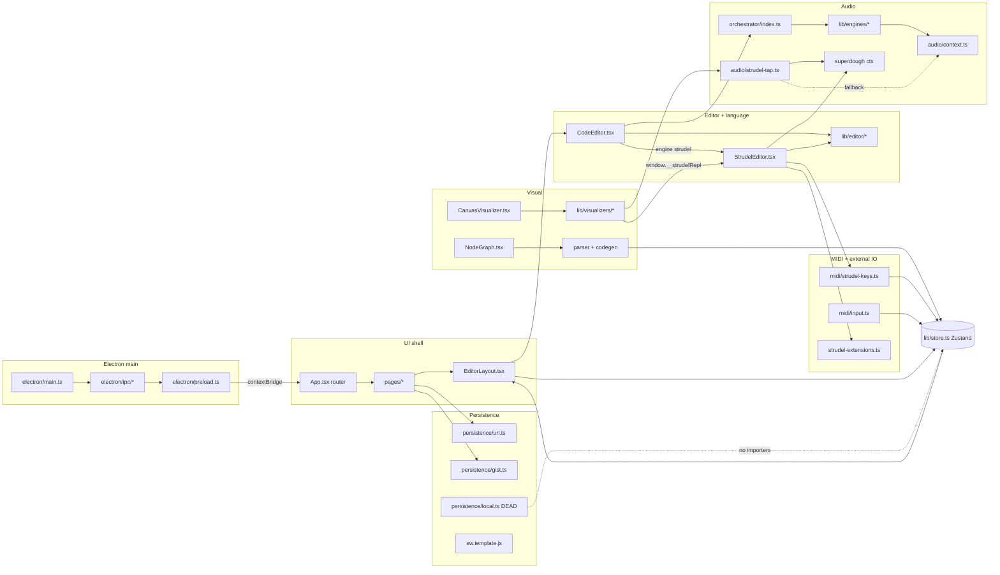
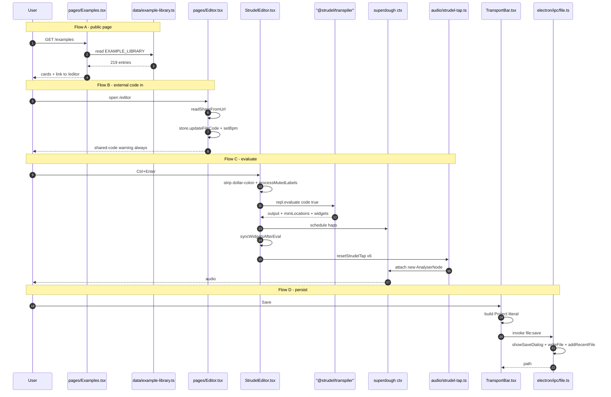
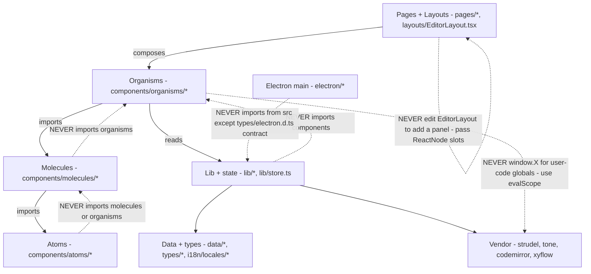

# Live Music Coder (Pro) — Canonical Architecture Reference

**Repo:** `/Users/arnold/Development/wm-prototyp-live-music-coder`
**Stack:** React 19 + Vite 8 + Tailwind v4 + Zustand + CodeMirror 6 + Strudel (`@strudel/{core,web,webaudio,transpiler,codemirror,midi,osc,serial,soundfonts,tonal,xen,draw}`) + Tone.js + WebMIDI, shipped both as a Netlify SPA and as an Electron 41 desktop app (`electron-vite` + `electron-builder`).
**Licence:** AGPL-3.0-or-later (`LICENSING.md`, `LICENSE-AGPL`, `LICENSE-MIT`) — a deliberate OSS exception for this repo. Not drift; do not "fix".

---

## 1. System overview

Live Music Coder is a **single React SPA that hosts two unrelated surfaces behind one router**: a long-form marketing/browse site (Landing, Samples, Examples, Sessions, Docs, Blog, Changelog, Legal) and a full-bleed live-coding IDE at `/editor`. The same bundle ships to Netlify (`base:'/'`, `BrowserRouter`, service worker) and is packaged for desktop (`base:'./'`, `HashRouter`, SW skipped) from a second Vite config. There is **no server, no auth, no database and no payment path** — all state lives in the browser (Zustand + `localStorage`/`sessionStorage`), all persistence is client-side (URL hash, GitHub Gist, `.lmc` file via Electron IPC), and the "backend" is the browser's own Web Audio / Web MIDI / Web Serial stacks. The most important architectural fact is that the codebase's *nominal* abstractions (an `EngineAdapter` interface, an `Orchestrator`, an `AudioGraph` DAG, a `parser`/`codegen` pair) are largely **bypassed by the shipped Strudel path**, which lives almost entirely inside one 993-line organism, `src/components/organisms/StrudelEditor.tsx`.

### 1.1 Flow A — public marketing page (the "static route")

```
index.html → src/main.tsx (i18n init → global.css → createRoot)
  → src/App.tsx (isElectron ? HashRouter : BrowserRouter)
  → <ErrorBoundary> → optional <TitleBar/> → <Suspense fallback={<RouteLoader/>}>
  → lazy() chunk for the page (only Landing is eager)
  → page calls useScrollablePage() [opts out of body{overflow:hidden}]
     + usePageMeta({title,description,path})  [title/description/canonical only]
  → <SiteNav/>  (NAV_ITEMS drives DOM order + aria-current)
  → src/data/<x>-library.ts  → useState/useMemo filter+sort
  → FilterPill / SortSelect / ContentSidebar → cards
  → <Link to="/editor?…">  or  useInlinePlayer() (in-page audition)
```

Netlify serves it through the SPA rewrite `/* → /index.html 200` (`netlify.toml`); the service worker (`dist/sw.js`, produced only by the `postbuild` hook `scripts/inject-sw-version.mjs`) does cache-first for `/assets/`, stale-while-revalidate for everything else, and skips `/samples/`.

### 1.2 Flow B — the primary user action: code → sound (Strudel, the default engine)

```
keystroke → CM6 updateListener → useAppStore.updateFileCode()
  → [liveMode && (isPlaying||composeMode)] → 150/300 ms debounce → repl.evaluate(RAW doc, true)

Ctrl/Cmd+Enter (or Run) → StrudelEditor.handleEvaluate()
  → resumeContext()  (src/lib/audio/context.ts — the SHARED ctx)
  → code = doc.replace(/^\$\s*:\s*/gm,'')          ← strips $: labels  [BUG, §5.1]
  → processMutedLabels(code)                        (src/lib/strudel-extensions.ts:248)
  → replRef.current.evaluate(code, true)
      → @strudel/transpiler (acorn → estree-walker → escodegen)
        · "…"/`…` → m(str, offset)          · slider(…) → sliderWithID("slider_<off>",…)
        · .<registeredWidget>() → widget id  · $: pat → pat.p('$')  · return on last stmt
        → { output, miniLocations, widgets } → repl.state → afterEval({code,pattern,meta})
      → superdough's OWN AudioContext → controller.output.destinationGain → its destination
  → syncWidgetsAfterEval(view, repl)  (src/lib/editor/inline-widgets.ts)
     → updateSliderWidgets / updateWidgets / updateMiniLocations
  → resetStrudelTap() ×6 (StrudelEditor.tsx:652-657)   [leak, §5.2]

RAF loop while isPlaying → repl.scheduler.now() → pattern.queryArc(now, now+0.125)
  → hap.context.locations → setHighlights → repo-owned highlightField decorations
  → pattern-fed visualizers (pianoroll/punchcard/spiral/pitchwheel) query the same repl
  → analyser-fed visualizers (waveform/spectrum/timeline) poll getStrudelAnalyser()
     (src/lib/audio/strudel-tap.ts → superdough destinationGain, else getMasterAnalyser())
```

The **non-Strudel engines take a completely different route**: `TransportBar.handlePlay` / `CodeEditor.handleManualEvaluate` → `getOrchestrator().evaluate(code, engine)` → `createEngineAsync(type)` → `engine.evaluate()` → `Function()` → the *shared* `AudioContext` from `src/lib/audio/context.ts` (`masterGain → masterAnalyser → destination`). Tone.js's `.toDestination()` bypasses `masterGain` entirely.

### 1.3 Flow C — share-link ingest (the closest thing to an "authenticated route")

```
ShareDialog → generateShareUrl({code,bpm,engine})  (src/lib/persistence/url.ts)
  → lz-string compress → origin+pathname+'#code=…'

recipient opens link → src/pages/Editor.tsx:57-73
  → location.state.share ?? readShareFromUrl()   [dual BrowserRouter/HashRouter reader]
  → useAppStore.updateFileCode() + setBpm()
  → setShowSharedWarning(true)   ← ALWAYS, because the payload is untrusted code
  → hash cleared
  → user presses Run → Flow B → Function()/transpiler evaluates a stranger's code
```

Gist is the second ingest: `GistDialog` / `DetailPanel.SavedGistsList` → `parseGistId` → `gists.get` → `files['project.json']` → `deserializeProject` (`src/lib/persistence/local.ts:98-112`) → `useAppStore.getState().loadProject({bpm,defaultEngine,files,layout})`. **The PAT is required even to read a gist, and every gist is created `public:false`** — see §5.4.

### 1.4 Flow D — desktop save / packaging / update (the "money path" analog)

There is no revenue path in this repo. The equivalent irreversible, user-facing pipeline is desktop persistence + release:

```
TransportBar (Electron only, TransportBar.tsx:353-368)
  → builds a Project literal INLINE → electronAPI.saveProject(JSON.stringify(project))
  → ipcRenderer.invoke('file:save') → electron/ipc/file.ts → showSaveDialog(filters:['lmc'])
  → fs.writeFile utf-8 → addRecentFile (electron/store.ts → userData/preferences.json)

release:  electron-vite build (main→out/main/main.cjs, preload→out/preload/preload.cjs,
                               renderer→dist/)
       → electron-builder → release/ (dmg+zip arm64/x64 notarized, nsis+portable, AppImage+deb)
       → publish provider github → electron/updater.ts (autoDownload, +5s then 4h)
       → 'update-downloaded' → dialog → quitAndInstall()

web:   npm run build (tsc -b && vite build) → postbuild inject-sw-version.mjs
       → MANUAL `netlify deploy --prod --dir=dist`   (CD disabled 2026-04-13, netlify.toml)
```

The read half of this loop does not exist: `file:open` is implemented and exposed but has **no renderer caller**, the `.lmc` file association is declared in `package.json build.fileAssociations` but never handled, and the entire `menu:action` channel has no subscriber (§5.5).

---

### Diagrams

> Generated 2026-08-17 by re-running the synthesis from the cached subsystem reads (`wf_5bf56d1f-bf1`) after `wm-architecture-map` gained its diagram section. Four by rule, not one per section. Every box traces to a real file named elsewhere in this document.

### Subsystem context



### Lifecycle sequences



### Dependency graph

```mermaid
flowchart TD
  types["types/engine.ts + types/project.ts"]
  store["lib/store.ts"]
  ctx["lib/audio/context.ts"]
  base["lib/engines/base.ts"]
  idx["lib/engines/index.ts"]
  we["engines/webaudio.ts"]
  te["engines/tonejs.ts"]
  me["engines/midi.ts"]
  se2["engines/strudel.ts"]
  orch["orchestrator/index.ts"]
  graph["orchestrator/graph.ts UNUSED"]
  tap["audio/strudel-tap.ts"]
  rec["audio/recorder.ts"]
  anal["audio/analyzer.ts"]
  setup["editor/setup.ts"]
  exts["editor/extensions.ts"]
  comp["editor/completions.ts"]
  themes["editor/themes.ts"]
  iw["editor/inline-widgets.ts"]
  ce["CodeEditor.tsx"]
  se["StrudelEditor.tsx"]
  keys["midi/strudel-keys.ts"]
  sx["strudel-extensions.ts"]
  cv["CanvasVisualizer.tsx"]
  vd["lib/visualizers/*"]
  ng["NodeGraph.tsx"]
  par["lib/parser + lib/codegen"]
  url["persistence/url.ts"]
  gist["persistence/gist.ts"]
  loc["persistence/local.ts"]
  tb["TransportBar.tsx"]
  gd["GistDialog.tsx"]
  pre["electron/preload.ts"]
  eipc["electron/ipc/*"]

  types --> base --> we & te & me & se2
  types --> idx --> we & te & me & se2
  idx --> orch --> graph
  ctx --> base & we & te & rec & tap
  anal --> vd
  tap --> vd --> cv
  se --> vd
  setup --> ce & se
  exts --> ce & se
  comp --> exts
  themes --> setup
  iw --> se
  ce --> se
  ce --> orch
  tb --> orch
  se --> keys & sx
  ng --> par --> store
  store --> ce & se & ng & cv & tb
  url --> tb
  gist --> gd --> loc
  loc --> gd
  tb --> pre --> eipc
```

### Layers and what may not cross



---

## 2. Subsystem reference

### 2.1 Audio engines & orchestrator

**Key files:** `src/types/engine.ts` · `src/lib/engines/base.ts` · `src/lib/engines/index.ts` · `src/lib/engines/strudel.ts` · `src/lib/engines/tonejs.ts` · `src/lib/engines/webaudio.ts` · `src/lib/engines/midi.ts` · `src/lib/orchestrator/index.ts` · `src/lib/orchestrator/graph.ts` · `src/lib/audio/context.ts` · `src/lib/audio/strudel-tap.ts` · `src/lib/audio/recorder.ts` · `src/lib/audio/analyzer.ts` · `src/lib/audio/solo-mute.ts` · `src/lib/audio/sample-import.ts` · `src/lib/strudel-extensions.ts` · `src/lib/midi/strudel-keys.ts` · `src/components/organisms/StrudelEditor.tsx`

**Shape.** `EngineAdapter` (`src/types/engine.ts`) declares `init/createNode/connect/start/stop/dispose/getAnalyserNode/getAnalyserForBlock` — **`evaluate()` is deliberately absent and is duck-typed** by `Orchestrator.evaluate()`. `BaseEngine` (`src/lib/engines/base.ts`) supplies node/analyser maps, `connectToMaster()` and a per-block analyser cache. `createEngineAsync(type)` in `src/lib/engines/index.ts` code-splits Tone (636 KB) and WebMidi (68 KB) and carries `ENGINE_META`.

**Control flow.** Two parallel paths, not one pipeline:
- *Strudel* — `src/components/organisms/CodeEditor.tsx:243` early-returns to `StrudelEditor`, which owns its own `initStrudel({afterEval})`, sample load, `evalScope(@strudel/midi)`, widget registration, highlight RAF loop and `window.__strudelRepl`. `src/lib/engines/strudel.ts` is a thin wrapper whose `createNode()` returns a dummy passthrough gain; **Strudel audio never touches it**.
- *Tone / WebAudio / MIDI* — `getOrchestrator().evaluate(code, type)` → `createEngineAsync` → `engine.evaluate()` → `Function()`. `src/lib/engines/webaudio.ts` wraps the ctx in a `Proxy` rewriting `.destination → masterGain` and tracking `createOscillator/BufferSource/ConstantSource` for stop-on-reeval; it regex-strips user `new AudioContext()`. `src/lib/engines/tonejs.ts` calls `Tone.setContext(sharedCtx)` and taps `Tone.getDestination() → masterAnalyser`. `src/lib/engines/midi.ts` is output-only WebMIDI (`stop()` sends CC123 on 16 channels).

**There are three live `AudioContext`s**: the shared one at `src/lib/audio/context.ts:20`, superdough's own (nothing in `src/` ever calls `setAudioContext(sharedCtx)`), and a private one at `src/lib/midi/strudel-keys.ts:45` for the audition synth.

**Extension points.**
- New engine → `src/lib/engines/webaudio.ts` (114 lines) is the reference adapter. Four edits: `EngineType` union in `src/types/engine.ts`; the adapter class; `case` + `ENGINE_META` in `src/lib/engines/index.ts`; CM6 highlighting via `getEngineExtensions()` in `src/lib/editor/extensions.ts`. Route output through `getMasterGain()` or recording and master volume will not work.
- New Tone instrument → `synthMap` in `ToneJsEngine.createSynth()` (`src/lib/engines/tonejs.ts:129`); numeric keys read from `block.params.synthType`.
- New effect → **no abstraction exists.** `AudioGraph.connect()` records an edge; `BaseEngine.connect()` does the real `node.connect()` but nothing calls it from graph state.
- New capture format → `src/lib/audio/recorder.ts`; an unused Electron WAV path already exists (`electron/ipc/audio.ts`, `electron/wav-encoder.ts`, `electron/preload.ts:19`).

### 2.2 Editor & language layer

**Key files:** `src/lib/editor/setup.ts` · `extensions.ts` · `completions.ts` · `theme.ts` · `themes.ts` · `inline-widgets.ts` · `evaluate.ts` · `error-help.ts` · `src/lib/midi/compose-mode.ts` · `src/types/strudel.d.ts` · `src/components/organisms/CodeEditor.tsx` · `src/components/organisms/StrudelEditor.tsx`

**Two CM6 instantiations, not one.** `CodeEditor.tsx` mounts the generic stack for `tonejs`/`webaudio`/`midi` (`CodeEditor.tsx:171`, `getBaseExtensions()` with **no themeId**, no vim, no font-size/word-wrap, its own `flashField`/`setFlash` and `.cm-eval-flash`). `StrudelEditor.tsx:484-529` builds the full stack:

```
getBaseExtensions(editorTheme) → chrome, editing helpers, ONE merged keymap.of([...]),
                                 theme chrome+highlight, EditorState.tabSize.of(2)
getEngineExtensions(engine)    → javascript() + autocompletion({override:[…]})
highlightField                 → repo's own sounding-note DecorationSet (StrudelEditor.tsx:28)
updateListener                 → store sync + debounced live-eval
evalKeymapExt                  → Ctrl/Cmd-Enter, Alt-1..9 solo, Shift-Alt-1..9 mute
[vim()]                        → dynamic import @replit/codemirror-vim
[fontSize] / [lineWrapping]    → localStorage 'lmc-editor-settings'
[sliderPlugin, widgetPlugin, highlightExtension, flashField] → @strudel/codemirror, if loaded
```

The view is destroyed and rebuilt on `[activeFile?.id, activeFile?.engine, ready, editorTheme, vimMode]` (`StrudelEditor.tsx:548`); because `ready` flips *after* init, the first view is built without any `@strudel/codemirror` extension and thrown away. CM6 state is never mirrored in React — `editorRef`/`viewRef`/`replRef` are plain refs.

**The parser split — be precise.** `@strudel/transpiler` does all real parsing of user code and is **never imported directly by repo code** (only pre-bundled in `vite.config.ts:32` / `electron.vite.config.ts:60`, typed in `src/types/strudel.d.ts:46`); it arrives transitively via `initStrudel()` → `webaudioRepl({...opts, transpiler})`. `src/lib/parser/index.ts` is a **regex block extractor for the node graph**, not a language parser — its only consumer is `src/components/organisms/NodeGraph.tsx:112`, and `parseStrudel()` returns the whole file as one opaque `strudel_main` block. `src/lib/codegen/index.ts` is its inverse (`NodeGraph.tsx:123`). The repo's only text transforms on Strudel source are the `$:` strip (`StrudelEditor.tsx:632` and again in `src/lib/engines/strudel.ts:42`) and `processMutedLabels()` (`src/lib/strudel-extensions.ts:248`).

**Autocomplete.** One source per engine, installed as `autocompletion({ override: [engineCompletionSource(engine)], activateOnTyping: true })` (`src/lib/editor/completions.ts:417`). `override` **replaces all sources**, so `javascript()`'s own completions never fire. Counts: 279 Strudel (219 of them Dirt-Samples keywords — the in-file comment says "218"), 16 Tone.js, 9 Web Audio, **0 for `midi`** (`COMPLETION_MAP.midi = []`). `@strudel/codemirror`'s richer JSDoc-driven `autocomplete.mjs` is bundled but unused.

**Extension points.** Global CM6 extension → `src/lib/editor/setup.ts:36-72` (array order = facet precedence). Per-engine → `src/lib/editor/extensions.ts:18` (the only file both organisms call — the correct seam). Strudel-only → inside the `if (strudelCM)` block at `StrudelEditor.tsx:518-529`. Keybinding → `evalKeymapExt` (`StrudelEditor.tsx:454-481`) or the merged `keymap.of([...])` in `setup.ts:56`. Completion → append a `CompletionItem` (`apply` **is** the snippet mechanism; there is no `@codemirror/autocomplete` `snippet()` anywhere). Theme → `EDITOR_THEMES` in `src/lib/editor/themes.ts:151`. Friendly error → `ERROR_PATTERNS` in `src/lib/editor/error-help.ts:15` (first match wins).

### 2.3 Visualizers & the node graph

**Key files:** `src/components/atoms/CanvasVisualizer.tsx` · `src/components/organisms/VisualizerDashboard.tsx` · `src/components/molecules/VisualizerPills.tsx` · `src/lib/visualizers/{colors,waveform,spectrum,timeline,pianoroll,punchcard,spiral,pitchwheel,midi-utils}.ts` · `src/components/organisms/PianorollVisualizer.tsx` · `src/components/organisms/NodeGraph.tsx` · `src/components/atoms/EngineNode.tsx` · `src/layouts/EditorLayout.tsx:137,169`

`CanvasVisualizer` owns the **only** rAF loop: `ResizeObserver`, DPR backing-store scaling with `ctx.setTransform(dpr,…)`, and a `drawRef` indirection so prop changes don't restart the loop. **It passes CSS pixels to `draw`** (`CanvasVisualizer.tsx:52-55`) — this is the invariant `CLAUDE.md` gets wrong (§5.3). `VisualizerPills` caps active panels at `MAX_ACTIVE = 3`.

Two feeds: **analyser-fed** (`waveform`, `spectrum`, `timeline`) poll `getStrudelAnalyser()` every 15th frame and draw a module-level `EMPTY_WAVEFORM`/`EMPTY_SPECTRUM` until connected; **pattern-fed** (`pianoroll`, `punchcard`, `spiral`, `pitchwheel`) call `getRepl()` → `window.__strudelRepl` → `repl.scheduler.now()` + `queryArc()`. Three read BPM/isPlaying directly via `useAppStore.getState()` inside the draw fn (`spiral.ts:41`, `pitchwheel.ts:110`, `punchcard.ts:179`) — deliberate, avoids re-render churn. `PianorollVisualizer` is the one bidirectional panel: `drawPianoroll` writes layout into `eventSink` (`pianoroll.ts:462-472`), React hit-tests against `eventSinkRef.current`, and velocity/pitch drags mutate overrides that are **visual only and never written back to code**.

**NodeGraph** is a derived, mostly read-only view: `store.files[active].code` → `parseCode(code, engine)` → `blocksToNodes`/`connectionsToEdges` → React Flow (`nodeTypes` correctly module-level at `NodeGraph.tsx:33`). Reverse edits regenerate code via `generateCode` → `updateFileCode`. **For `strudel` and `midi` it is a permanent empty state** — `parseStrudel` returns exactly one block and zero connections.

**Extension points.** New visualizer = 5 mechanical edits: `src/lib/visualizers/<name>.ts` (pure `draw<Name>(ctx,width,height,…)`, colors only from `VIZ_COLORS`) → `src/components/organisms/<Name>Visualizer.tsx` (copy `SpectrumVisualizer.tsx` for analyser-fed, `SpiralVisualizer.tsx` for pattern-fed) → key in `src/types/project.ts:15-23` → default in `src/lib/constants.ts` `DEFAULT_LAYOUT.visiblePanels` → `VisualizerPills.PANELS` + `VisualizerDashboard.activePanels` + `panels.<name>` in all three locales. New node type = atom next to `EngineNode.tsx` + registration in the module-level `nodeTypes` + emit from `blocksToNodes` + teach `src/lib/parser/index.ts` and `src/lib/codegen/index.ts` symmetrically.

### 2.4 MIDI, external I/O, input

**Key files:** `src/lib/midi/strudel-keys.ts` · `src/lib/midi/input.ts` · `src/lib/midi/midi-learn.ts` · `src/lib/midi/compose-mode.ts` · `src/lib/input/gamepad.ts` · `src/lib/strudel-extensions.ts` · `src/lib/engines/midi.ts` · `src/data/midi-devices.ts` · `src/components/organisms/MidiPanel.tsx` · `src/components/atoms/VirtualKeyboard.tsx`

Four loosely-coupled paths, all initialised from `StrudelEditor`, all talking to raw Web MIDI rather than one abstraction:

1. **Pattern source** — `customMidikeys()` (`strudel-keys.ts:151`) / `customMidin()` (`:329`) replace `@strudel/midi`'s versions, which break on Vite's double `@strudel/core` instance. Notes: listener (`:194`) → 50 ms per-note throttle (`:225-230`) → either `composeNoteOn()` or `playOscillatorNote()` + buffer a `Hap` into `kHaps` → the `kb()` Pattern queries the buffer per cycle (`:283-319`).
2. **UI monitor** — `initMidiInput()` (`src/lib/midi/input.ts`) has its own `requestMIDIAccess`, CC/note store and pub-sub; only consumer is `MidiPanel`.
3. **Mapping** — `src/lib/midi/midi-learn.ts` (persisted to `localStorage['lmc-midi-learn']` via `safeJsonParse`) and `src/lib/midi/compose-mode.ts` (note-on → mini-notation written straight into the CM6 doc, 20 ms chord window, own undo stack).
4. **Gamepad** — `src/lib/input/gamepad.ts`, rAF poll of `navigator.getGamepads()`.

CC→synth-UI: `customMidikeys` listener → `window.dispatchEvent('lmc-midi-cc')` (`strudel-keys.ts:203-210`) → `StrudelEditor.tsx:127-148` (CC70/CC1→cutoff log-scaled, CC71→resonance, CC72→osc type) → Zustand → `window.__lmcSetFilter`. `.osc()` targets `ws://localhost:8080` and requires the `@strudel/osc` bridge process; `.serial()` requires Chromium + a user-gesture port picker.

**Extension points.** New UI CC mapping → branch in the `handleCc` switch (`StrudelEditor.tsx:127-148`) + Zustand setter + `CC_NAMES` label (`MidiPanel.tsx:21-36`). Pattern-side CC needs no code (`midin(dev)(cc).range(a,b)` already works) — only a doc entry in `SidePanel.tsx:663-670` and an example in `src/data/example-library.ts` (category `'MIDI Input'`). Device-aware defaults → `src/data/midi-devices.ts` is complete, tested and **unwired**; plug `detectDeviceProfile(input.name)` into `input.ts:45` or `StrudelEditor.tsx:184` and feed `generateStrudelMidimap(profile)` into `handleCc`. New external I/O target → loader beside `loadOSC`/`loadSerial` (`strudel-extensions.ts:37-58`) + the `Promise.allSettled` list (`:286-291`) + module shim in `src/types/strudel.d.ts:121-132` + `vite.config.ts` `optimizeDeps.include`/`resolve.dedupe` (`:22-38`) + widen `connect-src` in **both** `netlify.toml` and `electron/main.ts:155-171`.

### 2.5 Persistence, sharing & PWA

**Key files:** `src/types/project.ts` · `src/lib/persistence/local.ts` · `url.ts` · `gist.ts` · `src/components/molecules/ShareDialog.tsx` · `src/components/organisms/GistDialog.tsx` · `src/components/organisms/DetailPanel.tsx:19-79` · `src/components/organisms/TransportBar.tsx:353-368` · `electron/ipc/file.ts` · `electron/store.ts` · `src/sw.template.js` · `scripts/inject-sw-version.mjs` · `src/main.tsx:27-40` · `public/manifest.json` · `public/_headers` · `netlify.toml`

Three independent sinks with **no unifying persistence service** — each consumer builds a `Project` literal inline and picks one:
- **IndexedDB** (`idb`, `openDB('live-music-coder', 1)`, stores `projects` + `collection`) — fully written, `saveProject/loadProject/listProjects/deleteProject/setupAutosave` all present, **zero importers outside `local.ts` and `local.test.ts`**. Only `safeJsonParse` is consumed.
- **URL share** (`lz-string`) — `generateShareUrl` / `readShareFromUrl` (dual BrowserRouter/HashRouter reader).
- **GitHub Gist** (`@octokit/rest`) — `saveToGist` (always `public:false`), `loadFromGist`, PAT storage with an AES-GCM path.
- **`.lmc`** — write via `electron/ipc/file.ts`, read implemented but uncalled.

`Project` shape: `id`, `name`, `version: 1`, `created`, `updated`, `bpm`, `defaultEngine`, `files[]`, `graph`, `layout`. The `.lmc` file is exactly `JSON.stringify(project)`; the gist additionally writes each `file.name → file.code` as sibling gist files (`gist.ts:146-149`).

**Token model.** `remember=false` → plaintext `sessionStorage['lmc-gist-token']`. `remember=true` → AES-GCM-256, **key exported raw + base64 into `sessionStorage['lmc-gist-key']`**, `iv||ciphertext` into `localStorage['lmc-gist-token-enc']`. Legacy plaintext `localStorage['lmc-gist-token-persist']` is still read (`gist.ts:95-96`).

**PWA.** `src/sw.template.js` → `dist/sw.js` via the `postbuild` hook. `install` → `cache.addAll(APP_SHELL)` + `skipWaiting()`; `activate` → delete old caches → `clients.claim()` → `clients.forEach(c => c.navigate(c.url))`; `fetch` → skip non-GET/cross-origin/`/samples/`, cache-first `/assets/`, else SWR.

**Extension points.** Adding a persisted field is 5 ordered edits — see §3.7. Migrating IDB requires rewriting `upgrade(database)` (`local.ts:21-31`) to branch on `oldVersion` and bumping `DB_VERSION` in the same commit; note `deserializeProject` **hardcodes `version: 1` and discards `parsed.version`** (`local.ts:101`). New share target has no registry — copy the `url.ts` + dialog-organism pattern and funnel loads through `useAppStore.getState().loadProject(...)`.

### 2.6 Electron desktop layer

**Key files:** `electron/main.ts` · `electron/preload.ts` · `electron/ipc/{app,file,audio,window}.ts` · `electron/wav-encoder.ts` · `electron/store.ts` · `electron/menu.ts` · `electron/tray.ts` · `electron/updater.ts` · `build/entitlements.mac.plist` · `build/entitlements.mac.inherit.plist` · `electron.vite.config.ts` · `src/types/electron.d.ts` · `src/lib/platform.ts` · `src/lib/electron.ts`

1805 LOC of main-process shell wrapping the *same* React SPA. `"type": "module"` in `package.json` but main/preload are emitted **CJS** (`formats: ['cjs']` → `out/main/main.cjs`), which is why `__dirname` works. Renderer detection is runtime, not build-time: `src/lib/platform.ts` and `src/lib/electron.ts` both test `!!window.electronAPI`; `src/App.tsx:35` picks the router from it, `src/main.tsx:16` adds `.electron-mac`, `src/main.tsx:32` skips SW registration on non-`http(s):`.

**Security posture — what is right:** `contextIsolation: true`, `nodeIntegration: false`, `sandbox: true` on both the main window (`electron/main.ts:65-70`) and pop-out children (`electron/ipc/window.ts:56-61`); `webSecurity` never disabled; preload uses only `contextBridge` + `ipcRenderer`. **What is wrong:** CSP exists only as a `webRequest.onHeadersReceived` header (`main.ts:155-171`) with no `<meta>` fallback, and `webRequest` does not intercept `file://` — the packaged build very likely runs with **no CSP**. There is **no `will-navigate` handler anywhere**, and `setWindowOpenHandler` (`main.ts:97`) covers only `window.open` on the main window. No `session.setPermissionRequestHandler`, no `requestSingleInstanceLock()`.

**Preload surface:** 17 methods; **only 2 are ever called from `src/`** (`saveProject` and `notify`, both at `src/components/organisms/TransportBar.tsx:367,374`). The only properly validated handler is `window:popout` (`ALLOWED_PANELS` allowlist + `MAX_POPOUTS`, `electron/ipc/window.ts:15-23`) — copy that, not `resolveAllowedPath`.

**Extension points.** New IPC end-to-end = handler in `electron/ipc/<domain>.ts` exporting `register<Domain>Handlers(mainWindow)` → register in `electron/main.ts` near lines 176-179 → one line in `contextBridge.exposeInMainWorld` in `electron/preload.ts` (listeners must return their unsubscribe closure) → signature on `ElectronAPI` in `src/types/electron.d.ts` (**not** `src/types/global.d.ts`) → renderer call guarded by `electronAPI?.`. New preference → `AppPreferences` + `DEFAULTS` in `electron/store.ts` (schema-less `{...DEFAULTS, ...JSON.parse(raw)}` merge, so adding a key is backwards-safe).

⚠️ **`electron/` is not type-checked by `npm run build`** — `tsconfig.app.json` includes only `src`, `tsconfig.node.json` only the two vite configs.

### 2.7 UI shell, routing, i18n, content, build/test/deploy

**Key files:** `src/main.tsx` · `src/App.tsx` · `src/lib/platform.ts` · `src/layouts/EditorLayout.tsx` · `src/components/organisms/SiteNav.tsx` · `src/components/molecules/ContentSidebar.tsx` · `src/lib/usePageMeta.ts` · `src/lib/useScrollablePage.ts` · `src/i18n/index.ts` · `src/i18n/locales/{de,en,es}.json` · `src/styles/global.css` · `src/styles/tokens/{index,colors,typography,spacing}.css` · `eslint.config.js` · `scripts/sync-changelog.ts` · `scripts/inject-sw-version.mjs` · `netlify.toml` · `public/_headers`

`EditorLayout` is the **only** layout: 7 `ReactNode` slots (`toolbar/activityBar/editor/graph/visualizers/detailPanel/statusBar`), mouse + arrow-key resize handles (`role="separator"`), `zenMode` and `useMediaQuery('(max-width:768px)')` branches, sizes from `useAppStore().layout`.

**Atomic Design holds — verified across all 70 files in `src/components/`: zero upward imports.** 17 atoms, 19 molecules, 27 organisms, 3 `index.ts` barrels, 4 colocated tests.

**Tailwind v4 is present but NOT wired to the tokens** — `@tailwindcss/vite` is registered in both configs and `global.css` does `@import "tailwindcss"`, but there is **no `@theme` block and no `tailwind.config.js`** anywhere. Components therefore use Tailwind for layout only (`flex`, `min-h-0`, `shrink-0`, `sr-only`) and inline `style={{ color: 'var(--color-text)' }}` for everything themed. A new token is invisible to Tailwind until an `@theme` layer is added.

**i18n:** 3 locales, `en` fallback, resources inlined. **642 leaf keys and 30 top-level namespaces in each of `de.json`/`en.json`/`es.json` — key sets diff to zero.** 249 distinct `t('…')` keys used in code, all resolve. 38 of 63 components have no `useTranslation`.

**Content (`src/data/`, 12 files = 9 data + 3 tests):** `example-library.ts` **219** entries / 18 categories · `sample-library.ts` 196 base → **1745** entries / 22 categories · `sessions-library.ts` **49** sessions / 15 categories (AGPL header — the only non-MIT source file) · `templates.ts` 32/10 · `docs.ts` **14** sections · `changelog-library.ts` 20 entries with full DE/ES `i18n` · `blog-library.ts` 5 posts · `midi-devices.ts` 19 profiles · `legal.ts` German `IMPRESSUM_HTML` + `DATENSCHUTZ_HTML` via `dangerouslySetInnerHTML`.

**Gates:** `npx vitest run` → **25 files, 158 tests green (~3 s)**; `npx tsc --noEmit` clean; `npm run lint` **RED: 45 errors + 10 warnings across 16 files**; `.github/` contains only `FUNDING.yml` + `PULL_REQUEST_TEMPLATE.md` — **there is no CI workflow at all**, and `npm run build` = `tsc -b && vite build` only.

---

## 3. The wiring map

> Precedents are given as `copy <file>` or `pattern: <file>:<line>`. Steps are in dependency order — doing them out of order produces the exact drift bugs listed in §5.

### 3.1 New marketing page (public route)

| # | File | What | Precedent |
|---|---|---|---|
| 1 | `src/pages/Foo.tsx` | `export default` component; first call is `useScrollablePage()`, then `usePageMeta({title,description,path})` | copy `src/pages/Blog.tsx` (smallest complete template: SiteNav + skip-link + `usePageMeta` + FilterPill/SortSelect + `.sticky-filters`/`.listing-hero`) |
| 2 | `src/App.tsx` | `const Foo = lazy(() => import('./pages/Foo'))` + `<Route path="/foo" element={<Foo/>}/>` **above** the `path="*"` catch-all | pattern: `src/App.tsx` route table (14 routes, Landing eager, 10 lazy) |
| 3 | `src/components/organisms/SiteNav.tsx` | add `{to:'/foo', i18nKey:'nav.foo'}` to `NAV_ITEMS` | — |
| 4 | `src/components/molecules/ContentSidebar.tsx` | add the **same** entry to `BROWSE_ITEMS` — this is a second source of truth (§5.6) | — |
| 5 | `src/i18n/locales/{de,en,es}.json` | `nav.foo` in **all three** | — |
| 6 | `public/sitemap.xml` | add the URL (hand-maintained; nothing generates it) | — |
| 7 | *optional* | if the page needs a footer link, edit `src/pages/Landing.tsx` — there is **no shared `Footer` organism** | — |

### 3.2 New component (atom / molecule / organism)

| # | Tier | File | Import ceiling | Barrel |
|---|---|---|---|---|
| 1 | Atom | `src/components/atoms/Foo.tsx` | `react`, `lucide-react`, `@xyflow/react`, `../../types/*`, `../../lib/constants` only | `export { default as Foo } from './Foo'` in `src/components/atoms/index.ts` |
| 2 | Molecule | `src/components/molecules/Foo.tsx` | `../atoms*` + lib/types | `src/components/molecules/index.ts` |
| 3 | Organism | `src/components/organisms/Foo.tsx` | `../atoms*`, `../molecules*`, `../../lib/*`, `../../data/templates`; same-tier peer imports allowed | `src/components/organisms/index.ts` |
| 4 | any | `Foo.test.tsx` colocated | `describe/it/expect` are globals; jsdom + jest-dom preloaded via `src/test-setup.ts` | — |

**IDE organisms are wired as `EditorLayout` slots from `src/pages/Editor.tsx`, never by editing `src/layouts/EditorLayout.tsx`** — the layout takes `ReactNode` props. Memoized default export for React Flow nodes: `export default memo(Component)` — pattern: `src/components/atoms/EngineNode.tsx`, re-exported named at `src/components/atoms/index.ts:10`.

### 3.3 New editor side-panel section (ActivityBar + DetailPanel)

| # | File | What |
|---|---|---|
| 1 | `src/components/organisms/ActivityBar.tsx` | append `{id, icon, label}` to `SECTIONS` — **label is currently hardcoded English, add `useTranslation` while you are there** (§5.8) |
| 2 | `src/components/organisms/DetailPanel.tsx` | add the matching `<AccordionSection>` case (precedent: the `'midi'` case at `DetailPanel.tsx:180` mounting `MidiPanel`) |
| 3 | — | no store change needed: `activeDetailSection: string \| null` is untyped — which also means **no compile-time check that the two lists agree** |
| 4 | `src/i18n/locales/{de,en,es}.json` | the label key |

⚠️ `EditorLayout` hides the ActivityBar, graph, resize handles and DetailPanel below 768px — anything placed here is unreachable on phones.

### 3.4 New visualizer panel

| # | File | What | Precedent |
|---|---|---|---|
| 1 | `src/lib/visualizers/<name>.ts` | pure `draw<Name>(ctx, width, height, …)`, no React; colors **only** from `VIZ_COLORS` (`src/lib/visualizers/colors.ts` — a new key must match a real token in `src/styles/tokens/colors.css` or `colors.test.ts` fails) | analyser-fed: `waveform.ts`; pattern-fed: `spiral.ts` |
| 2 | `src/components/organisms/<Name>Visualizer.tsx` | thin wrapper: `useCallback` draw + `<CanvasVisualizer draw={draw} ariaLabel="…" />` | copy `src/components/organisms/SpectrumVisualizer.tsx` (module-level empty buffer + 15-frame reconnect) or `SpiralVisualizer.tsx` (`getRepl` module fn) |
| 3 | `src/types/project.ts:15-23` | add key to `PanelLayout['visiblePanels']` | — |
| 4 | `src/lib/constants.ts` | add to `DEFAULT_LAYOUT.visiblePanels` (7 keys today; only `waveform` + `spectrum` default on) | — |
| 5 | `src/lib/persistence/local.ts:108-111` | add the key to `deserializeProject`'s layout fallback — **it already lags the type by 3 keys** (§5.9) | — |
| 6 | `src/components/molecules/VisualizerPills.tsx` | `PANELS` entry + icon (`MAX_ACTIVE = 3` still applies) | — |
| 7 | `src/components/organisms/VisualizerDashboard.tsx` | add to the `activePanels` array | — |
| 8 | `src/i18n/locales/{de,en,es}.json` | `panels.<name>` | — |
| 9 | pattern-fed only | use `src/lib/visualizers/midi-utils.ts` (`extractMidi`/`extractVelocity`) — **not** pianoroll's private copies (§5.10) | — |

### 3.5 New engine adapter

| # | File | What | Precedent |
|---|---|---|---|
| 1 | `src/types/engine.ts` | add to the `EngineType` union | — |
| 2 | `src/lib/engines/<name>.ts` | `class X extends BaseEngine` with `init/createNode/start/stop` **plus an `evaluate()`** — `evaluate` is *not* in `EngineAdapter`, it is duck-typed by `Orchestrator.evaluate()` | copy `src/lib/engines/webaudio.ts` (114 lines, simplest complete adapter) |
| 3 | `src/lib/engines/index.ts` | `case` in `createEngineAsync` + `ENGINE_META` entry (use `await import()` to keep the chunk split) | pattern: the Tone/WebMidi lazy cases |
| 4 | `src/lib/editor/extensions.ts:18` | `switch (engine)` branch for highlighting/completions | — |
| 5 | `src/lib/editor/completions.ts:381` | entry in `COMPLETION_MAP` — **omitting it makes `items` `undefined` and the source throws** (this is why `midi` has 0 completions) | — |
| 6 | `src/lib/audio/context.ts` | route output through `getMasterGain()` or recording + master volume silently do nothing | pattern: `webaudio.ts` ctx-Proxy `.destination → masterGain` |
| 7 | `src/lib/parser/index.ts` + `src/lib/codegen/index.ts` | optional; both are engine-switched and must stay symmetric or NodeGraph round-trips lose data | pattern: the `tonejs` regex pair |
| 8 | `src/components/organisms/EngineSelector.tsx` + `src/i18n/locales/*.json` | selector entry + `engines.<name>` label | — |

### 3.6 New Strudel runtime function / package / global

| # | File | What |
|---|---|---|
| 1 | `src/lib/strudel-extensions.ts` | add `loadX()` beside `loadOSC`/`loadSerial` (`:37-58`) |
| 2 | `src/lib/strudel-extensions.ts:286-291` | add it to the `Promise.allSettled` list in `loadAllExtensions()` |
| 3 | **preferred** | if user code must call it: `evalScope(import('@strudel/x'))` — pattern: `src/components/organisms/StrudelEditor.tsx:280-281`. The four existing loaders use bare `await import()`, which contradicts the repo's own stated rule (§5.11) |
| 4 | `src/types/strudel.d.ts:121-132` | module shim — otherwise you inherit the file-wide `eslint-disable no-explicit-any` |
| 5 | `vite.config.ts:22-38` **and** `electron.vite.config.ts:60` | `optimizeDeps.include` + `resolve.dedupe` — **the two lists already diverge** (§5.12) |
| 6 | `netlify.toml` **and** `electron/main.ts:155-171` | widen `connect-src` if it does network I/O |
| 7 | `src/lib/editor/completions.ts` | `CompletionItem` so users can discover it |
| 8 | `src/data/example-library.ts` | at least one example in the right category |

### 3.7 New persisted `Project` / layout field

| # | File | What |
|---|---|---|
| 1 | `src/types/project.ts` | add to `Project` / `PanelLayout` |
| 2 | `src/lib/constants.ts:28` | `DEFAULT_LAYOUT` — the canonical default |
| 3 | `src/lib/persistence/local.ts:98-112` | `deserializeProject` → `parsed.x ?? default`. **This is the only migration hook that exists**; there is no versioned migration |
| 4 | `src/components/organisms/TransportBar.tsx:355-366` | inline `Project` literal (`.lmc` writer) |
| 5 | `src/components/organisms/GistDialog.tsx:106-117` | the **second** inline `Project` literal — must change in lockstep. *Extracting one `buildProjectFromStore()` helper is the correct first refactor before adding any field.* |
| 6 | `src/lib/store.ts:171/431` | widen `loadProject(...)` — today only `bpm`, `defaultEngine`, `files`, `layout` are applied on load |

### 3.8 New share / persistence target

| # | Step |
|---|---|
| 1 | `src/lib/persistence/<target>.ts` — `encodeTo*/decodeFrom*` or `saveTo*/loadFrom*`, reusing `serializeProject`/`deserializeProject`. Copy `src/lib/persistence/url.ts` |
| 2 | Dialog organism/molecule; toolbar button next to the existing `setShowShare` / `setShowGist` state in `src/components/organisms/TransportBar.tsx` |
| 3 | Load side **must** funnel through `useAppStore.getState().loadProject(...)` (clamps BPM via `setBpm` — the D-4 fix noted at `GistDialog.tsx:148`) |
| 4 | Externally-sourced code **must** raise the shared-code warning — pattern: `src/pages/Editor.tsx:71` |
| 5 | Network I/O → add the host to `connect-src` in `netlify.toml` (today: `'self' api.github.com raw.githubusercontent.com *.githubusercontent.com freesound.org *.freesound.org`) — CSP blocks it in production only |
| 6 | Electron parity → new IPC handler in `electron/ipc/`, method in `electron/preload.ts`, type in `src/types/electron.d.ts` |

### 3.9 New Electron capability (IPC channel, menu item, pop-out)

| # | File | What | Precedent |
|---|---|---|---|
| 1 | `electron/ipc/<domain>.ts` | `register<Domain>Handlers(mainWindow: BrowserWindow)`; naming `domain:verb`; `invoke/handle` for request→response, `send/on` for fire-and-forget. **Validate every argument first** | copy `electron/ipc/window.ts:15-23` (`ALLOWED_PANELS` Set + `MAX_POPOUTS`) — **never** copy `resolveAllowedPath` (§5.13) |
| 2 | `electron/main.ts:176-179` | import + call, after `app.whenReady` (and after `createWindow()` if it needs the window) | — |
| 3 | `electron/preload.ts` | one line in `contextBridge.exposeInMainWorld('electronAPI', {...})`; listeners **return the unsubscribe closure** | pattern: `onFullscreenChanged` / `onPopoutClosed` |
| 4 | `src/types/electron.d.ts` | signature on `ElectronAPI` — **not** `src/types/global.d.ts` | — |
| 5 | renderer | `import { isElectron, electronAPI } from '../../lib/electron'`; `electronAPI?.method()`; web build must work with `electronAPI === null` | pattern: `src/components/organisms/TransportBar.tsx:367,374` |
| 6 | menu item | add to `template` in `electron/menu.ts` + `sendAction(mainWindow, '<action>')` — **then add the missing renderer `onMenuAction` subscriber**, none exists (§5.5) | — |
| 7 | pop-out panel | id into `ALLOWED_PANELS` (`electron/ipc/window.ts:15`) **and** a matching route in `src/App.tsx` — `/popout/*` currently 404s (§5.5) | — |
| 8 | type-check | `electron/` is invisible to `npm run build` — run `npx tsc --noEmit` against a config that includes it, or add `"electron"` to `tsconfig.node.json`'s `include` | — |

### 3.10 New MIDI mapping / input binding

| # | Kind | Files, in order |
|---|---|---|
| A | UI-side CC | `StrudelEditor.tsx:127-148` `handleCc` branch → Zustand setter in `src/lib/store.ts` → `CC_NAMES` in `src/components/organisms/MidiPanel.tsx:21-36`. ⚠️ `lmc-midi-cc` only fires after user code has run `midikeys()` (§5.14) |
| B | Pattern-side CC | no code — document in `SidePanel.tsx:663-670` + example in `src/data/example-library.ts` |
| C | Editor keybinding | `StrudelEditor.tsx:454-481` (Strudel) **and** `CodeEditor.tsx:161-168` (other engines); shape `{ key, mac?, run: () => { …; return true } }` |
| D | All-engine keybinding | merged `keymap.of([...])` in `src/lib/editor/setup.ts:56` |
| E | App-scope shortcut | **no registry exists** — the only document-level dispatcher is `strudel-extensions.ts:78-97` (`onKey`, user-code-facing). Needs a new listener + `electron/menu.ts` accelerator + the missing `onMenuAction` subscriber |

### 3.11 New content entry (example / sample / session / template / doc / blog / changelog)

| Content | File | Extra steps |
|---|---|---|
| Example | `src/data/example-library.ts` | append to `EXAMPLE_LIBRARY`. ⚠️ if appended after line 1086 it is **not** counted by `TOTAL_EXAMPLE_COUNT` (§5.15) |
| Sample | `src/data/sample-library.ts` | 196 base entries expand to 1745 with variations |
| Session | `src/data/sessions-library.ts` | German by design; slug drives `/sessions/:slug`; keep the AGPL header |
| Template | `src/data/templates.ts` | surfaces in `TemplateSelector`, `HelpPanel`, Landing |
| Doc section | `src/data/docs.ts` | typed `DocBlock[]` (`heading`/`text`/`code`/`list`); text via i18n keys in all 3 locales, code raw |
| Blog post | `src/data/blog-library.ts` | markdown body via `MarkdownRenderer`; English-authored by design |
| Changelog | `src/data/changelog-library.ts` | include `i18n:{de,es}` (20/20 entries have it), then `npm run sync:changelog` → regenerates `CHANGELOG.md` (⚠️ duplicate-version bug, §5.16) |

### 3.12 New UI string / new design token

| Kind | Steps |
|---|---|
| String | key under the right namespace in **all three** of `src/i18n/locales/{de,en,es}.json` → `const {t} = useTranslation()` → `t('ns.key')`. **No CI check exists** — write `src/i18n/locales.test.ts` |
| Token | declare under `:root` in `src/styles/tokens/{colors,typography,spacing}.css` (`tokens/index.css` already imports all three). Available as `var(--x)` immediately; **will not become a Tailwind utility** (no `@theme`). Canvas code cannot read CSS vars — mirror the value into `VIZ_COLORS` (`src/lib/visualizers/colors.ts`), which `colors.test.ts` validates against `colors.css` |

---

## 4. Boundaries & contracts

**Component hierarchy (verified, currently unbroken).** Atoms import nothing from other components. Molecules import only `../atoms`. Organisms import `../atoms` + `../molecules`. Layouts compose organisms. Pages use layouts. Peer imports within a tier are allowed. **Never import upward.**

**`EditorLayout` is slot-driven.** It takes 7 `ReactNode` props from `src/pages/Editor.tsx`. Adding an IDE feature means composing a new organism into a slot there, not editing `src/layouts/EditorLayout.tsx`.

**React Flow `nodeTypes` must stay module-level** (`src/components/organisms/NodeGraph.tsx:33`). Moving it inside the component remounts every node each render.

**`CanvasVisualizer` passes CSS pixels to `draw`.** `ctx.setTransform(dpr,…)` is already applied and `canvas.width / dpr` is handed in (`CanvasVisualizer.tsx:52-55`). Draw functions and anything reading `eventSink` must **not** divide by `devicePixelRatio` again.

**Canvas colours come only from `VIZ_COLORS`.** Canvas cannot resolve CSS custom properties; `src/lib/visualizers/colors.ts` is the literal-hex bridge and `colors.test.ts` parses `src/styles/tokens/colors.css` at test time to keep it honest.

**`src/lib/editor/extensions.ts` is the engine seam.** It is the only editor file both `CodeEditor.tsx` and `StrudelEditor.tsx` call. Engine-scoped CM6 behaviour belongs there or it will exist in only one of the two editors.

**Every engine in `COMPLETION_MAP` must have an entry** (`src/lib/editor/completions.ts:381`), even an empty array, or `engineCompletionSource` throws on `items`.

**`@strudel/transpiler` offsets are into the SUBMITTED string.** `miniLocations` and `widgets` are the sole source of truth for slider placement and mini-notation highlight. Any pre-processing that changes character offsets between the editor document and the submitted string breaks widget write-back. Today two transforms do exactly that (`$:` strip, `processMutedLabels`) — see §5.1/§5.2.

**Strudel globals go through `evalScope(import(...))`,** not `window.X = …`. (Contested: `midikeys`/`midin`/`sliderWithID` are wired as `window.X` at `StrudelEditor.tsx:290-291, 358-362` and demonstrably work — §5.11.)

**Never register a widget type whose `Pattern.prototype` method already exists.** `registerWidget(type, fn)` (`node_modules/@strudel/codemirror/widget.mjs:83`) *overwrites* the prototype method and pushes the name into the transpiler's global `widgetMethods`.

**The shared master chain is `masterGain → masterAnalyser → destination`** (`src/lib/audio/context.ts`). Anything that rebuilds it by hand must re-attach existing taps — three places currently do not (§5.17).

**Web MIDI is attached with `addEventListener('midimessage')`, never `onmidimessage`** — honoured at all four `requestMIDIAccess()` sites.

**`deserializeProject` is the only migration hook.** Every new persisted field needs a `parsed.x ?? default` there, and `Project.version` is currently hardcoded to `1` and the parsed value discarded (`src/lib/persistence/local.ts:101`).

**Load paths for external project data must funnel through `useAppStore.getState().loadProject(...)`** (BPM clamping) **and must raise the shared-code warning** (`src/pages/Editor.tsx:71`).

**Two `Project` literals must stay in lockstep**: `TransportBar.tsx:355-366` and `GistDialog.tsx:106-117`.

**New network hosts need `connect-src` in BOTH `netlify.toml` and `electron/main.ts:155-171`.**

**Electron: `sandbox: true` + `contextIsolation: true` + `nodeIntegration: false` on every `BrowserWindow`,** main and pop-out alike. Preload exposes only serializable data; listeners return unsubscribe closures.

**Electron IPC arguments are untrusted.** The renderer evaluates arbitrary shared code by design, so every handler must validate with an allowlist or range check before touching the filesystem or allocating.

**Web-vs-desktop is a runtime check (`!!window.electronAPI`), not a build flag.** Both codepaths ship in one bundle; the web build must keep working with `electronAPI === null`.

**AGPL header stays on `src/data/sessions-library.ts`** (the only non-MIT source file); `LICENSING.md` / `LICENSE-AGPL` / `LICENSE-MIT` are the dual-licence contract.

---

## 5. Gaps, stale docs & risks

Ordered roughly by blast radius. Every item below was verified against code by at least one reader; disagreements are flagged.

### Correctness — user-visible, high severity

**5.1 `$:` stripping corrupts the manual-Run path.** `StrudelEditor.tsx:632` strips `^\$\s*:\s*` before eval (duplicated at `src/lib/engines/strudel.ts:42`). Verified against the real transpiler: raw `setcps(1)\n$: a\n$: b\n$: c` compiles to three `.p('$')` registrations (all stacked); stripped, it becomes three bare statements of which **only the last receives the `return`**. So Run/Ctrl+Enter on any multi-`$:` session plays only the final layer, while the debounced live-eval path (`StrudelEditor.tsx:440`, raw doc) plays all of them. Every session in `src/data/sessions-library.ts` uses stacked `$:` (23 occurrences; `BETONSCHLUCHT_CODE` at `:4076` has four). The transpiler natively supports `$:` (`labelToP`; `repl.mjs:171-181` anonymous `$0/$1/…`), so the strip is unnecessary *and* destructive.

**5.2 Slider widgets write to the wrong characters when `$:` is present.** Measured: for `$: s("bd*4").gain(slider(0.5, 0, 1, 0.01))` the document offset of `0.5` is 25, but the transpiler run on the *stripped* text reports `from: 22`. `SliderWidget`'s input handler writes back with `{from: slider.from, to: from + value.length}` — dragging overwrites three wrong characters. `processMutedLabels` (3 chars → 13) shifts offsets further. The same off-by-N applies to `updateMiniLocations`. The live-eval path is correct; the two paths disagree.

**5.3 `@strudel/draw` widget registration clobbers the real painter API.** `StrudelEditor.tsx:306-352` (visualizer reader cites `:320-330`) calls `registerWidget('pianoroll', __pianoroll)`, `('punchcard', getPunchcardPainter)`, `('pitchwheel', pitchwheel)` and bare `('scope'|'spiral'|'spectrum')` — the **non-underscore** names. `registerWidget(type, fn)` (`widget.mjs:83-91`) assigns `Pattern.prototype[type] = function (id, options={fold:1}) { return fn(id, options, this) }` **only when `fn` is truthy**. That gate matters: **exactly 3 of the 6 painters are clobbered** — `pianoroll`, `punchcard`, `pitchwheel`, whose `fn`s resolve to real `@strudel/draw` exports (`__pianoroll`, `getPunchcardPainter`, `pitchwheel`; genuine painters at `pianoroll.mjs:79,293`, `pitchwheel.mjs:133`, all taking a single options object). `scope`/`spiral`/`spectrum` are passed with **no `fn`**, so `Pattern.prototype` is *not* overwritten for them — only `registerWidgetType` runs, which still pushes them into the transpiler's `widgetMethods` so plain `.scope(…)`/`.spectrum(…)` in user code gets a widget-ID string unshifted into arg 0, shifting every option. Both packages import `Pattern` from `@strudel/core` (single install, `vite.config.ts:22` dedupes), so the collision is real. Consequences: `._pianoroll()` — used in the `code:` field of **5 shipped examples** (`viz-pianoroll`, `viz-combo`, `viz-slider-pianoroll`, `test-pianoroll-inline`, `test-filter-sweep`; the "8" of an earlier draft counted 2 prose mentions in `description:` fields plus 1 snippet in `src/data/docs.ts`) — throws at `haps.filter(…)` (`pianoroll.mjs:150`), because `_pianoroll` internally calls `pat.tag(id).pianoroll({fold:1,…options,ctx,id})`, which now hits the clobbered wrapper and lands that options object in the `id` slot, leaving `haps` undefined. Plain `.pianoroll()`/`.punchcard()`/`.pitchwheel()` background painters are broken. The `_${method}` fallback loop (`:338-351`) is **dead** — `@strudel/codemirror/widget.mjs:106-140` already registers `_pianoroll/_punchcard/_spiral/_scope/_pitchwheel/_spectrum`. Both readers agree; both recommend deleting the block and registering only underscore types you actually own.

**5.4 Double DPR correction in the piano roll — and `CLAUDE.md` documents the wrong invariant.** `eventSink.noteHeight`/`yOffset` written at `pianoroll.ts:470-471` are CSS pixels (see §4). `PianorollVisualizer.tsx:131-133` and `:177-178` divide by `devicePixelRatio` again → on Retina, note hit-testing targets half-height rows and pitch drag is 2× oversensitive. `CLAUDE.md`'s "`noteHeight`/`yOffset` are physical pixels — divide by `devicePixelRatio`" is **stale**; `git show 64109df^:…/CanvasVisualizer.tsx` confirms CSS px were already being passed when the "DPR guard" was added. The velocity lane (`isInVelLane`, `findVelNote`) uses `getBoundingClientRect()` only and is correct.

**5.5 `TOTAL_EXAMPLE_COUNT` is wrong by 154.** `src/data/example-library.ts:1086` snapshots `EXAMPLE_LIBRARY.length` **before** lines 1104-1289 push ~154 more entries. Constant = **65**, real length = **219**. `src/pages/Examples.tsx:583` renders `{TOTAL_EXAMPLE_COUNT} {t('examples.patterns')}` — the page advertises "65 patterns" while showing 219. Fix: move the `export const` to end-of-file or make it a getter.

**5.6 Autocomplete inserts a double dot.** The matcher is `context.matchBefore(/[\w]+/)` (no leading dot) while ~60 items have `apply: '.lpf(800)'`. Typing `s("bd").l` yields `s("bd")..lpf(800)`. Either include the dot in `matchBefore` or drop it from `apply`. Minor companion: duplicate label `off` (function at `completions.ts:62`, sample keyword at `:312`).

### Duplicated / bypassed wiring

**5.7 Four independent `initStrudel()` instances.** `StrudelEditor.tsx:226` (audio reader) / `:227` (editor reader — *readers disagree on the exact line, same call*), `src/lib/engines/strudel.ts:29`, `src/components/organisms/ExampleGallery.tsx:82-83`, `src/lib/useInlinePlayer.ts:47-48`. `@strudel/web/web.mjs:31` reassigns a module-level `repl` on each call and each creates its own scheduler. Concretely: `TransportBar.tsx:117` calls `orch.evaluate(code, 'strudel')` on a Strudel tab, constructing a **second REPL + scheduler** beside `StrudelEditor`'s, both feeding one superdough context — doubled audio, and `window.__strudelRepl`, `repl.state.widgets` and the highlight RAF loop track only one of them. Each component's `stop()` stops only its own.

**5.8 Three `AudioContext`s → recording and master volume are broken for the shipped path.** `src/lib/audio/context.ts:20` (shared), superdough's own (`node_modules/superdough/audioContext.mjs:12`; nothing in `src/` calls `setAudioContext(sharedCtx)`), and `src/lib/midi/strudel-keys.ts:45`. `AudioRecorder` taps `masterGain` (`recorder.ts:20-22`) while superdough terminates at its **own** context's destination (`superdough/output.mjs:148`), so **recording a Strudel session yields silence**; it also misses the synth keyboard and Tone's `.toDestination()` output. `setMasterVolume()` (`context.ts:61`) is a separate and worse case: it has **zero callers anywhere in `src/`** — no UI, no store, no hook — so it is dead code, not a partially-working control. Were it wired, it would gate the Tone.js engine (`tonejs.ts:27,61`), the generic engine path (`base.ts:40`) and the two webaudio preview paths as well; **only** Strudel and the `strudel-keys` oscillator context escape it.

**5.9 No clock owner — and the BPM control is a no-op for the DEFAULT engine.** Tone owns `Tone.Transport`; Strudel owns `repl.scheduler` in cycles/cps. `TransportBar.tsx:152` → `getOrchestrator().setBpm()` → `orchestrator/index.ts:75-82` gates the forward on `if (type === 'tonejs' && 'setBpm' in engine)`, so only `engines/tonejs.ts:115-117` is ever reached; `StrudelEngine` exposes no tempo method at all. Strudel's tempo is `Cyclist.cps` (`@strudel/core/cyclist.mjs:24`, setter `:129`), reachable via `repl.setCps`/`repl.setCpm` — **neither is ever called from `src/`**. Since `DEFAULT_ENGINE = 'strudel'` (`src/lib/constants.ts:17`), the BPM control does nothing for the engine the app opens with. (Correction to an earlier draft: `setcps` *does* occur 5× in `src/data/sessions-library.ts` and `.cpm(` 42× across the data libraries — but those are Strudel **user-code strings inside session templates**, not app wiring, so they do not connect the control to the scheduler. Only the literal `setcpm` is absent from `src/`.) Compounding it: `getLeaderBpm()` (`strudel-extensions.ts:211-214`) reads `repl?.scheduler?.bpm`, a field the Cyclist does not define — it defines `cps` — so it always falls back to a hardcoded 120. There is also no MIDI clock (`0xF8/0xFA/0xFB/0xFC` are unhandled in `input.ts:70-103` and `strudel-keys.ts:198-215`); the only "clock sync" is the BroadcastChannel at `strudel-extensions.ts:158`, whose `sync`/`bpm` cases only `console.log`, and `broadcastBpm` has zero callers.

**5.10 Two graph models, one dead.** `src/lib/orchestrator/graph.ts` (`AudioGraph` — DAG, BFS cycle prevention, serialize/deserialize, plus `graph.test.ts`) is instantiated at `src/lib/orchestrator/index.ts:27` but never populated; only `this.graph.clear()` (line 118) runs, and `getGraph()` (line 91) has no callers. React Flow's `NodeGraph` keeps its own state. Nothing walks graph state to wire real `AudioNode`s.

**5.11 Dead surfaces, exhaustively.** `disposeContext()` and `disposeOrchestrator()` — zero callers, the AudioContext is never `close()`d · `BaseEngine.getAnalyserNode()` (`base.ts:44-50`) — leaks by design, no callers · `src/lib/audio/solo-mute.ts` — `isMuted`, `isSoloed`, `getSoloMuteState`, `clearSoloMute`, `extractLabels` all unconsumed; Alt+1..9 (`StrudelEditor.tsx:461-480`) mutates a `Set` nothing reads and `console.log`s. The only working mute is the unrelated text pre-processor `processMutedLabels()` · the **IndexedDB half** of `src/lib/persistence/local.ts` (`openDB`, private `getDb`, `saveProject`, `loadProject`, `listProjects`, `deleteProject`, `setupAutosave`) — zero consumers outside the file, so **there is no autosave and no local project list in the shipped app**, and no `localStorage`/`zustand-persist` substitute exists. (The `saveProject`/`loadProject` hits elsewhere are homonyms: `electronAPI.saveProject` → IPC `file:save`, and the Zustand action `loadProject` at `store.ts:171,431`.) The file is **not** otherwise dead — `serializeProject` (`local.ts:60`) and `deserializeProject` (`:80`) are live via `gist.ts:143,188`, so `local.ts` has five live exports, not one · the `'collection'` object store — created, never read or written · `getMidiMapping`/`getAllMappings` (`midi-learn.ts:153-160`) — MIDI Learn is write-only; the UI hardcodes `startMidiLearn('lpf')` (`StrudelEditor.tsx:915`) · `src/data/midi-devices.ts` — 19 tested profiles, no importer outside its test · `src/components/molecules/VisualizerToggle.tsx` — not exported from the barrel, not imported anywhere · `EngineNode`'s param block (`EngineNode.tsx:129-191`) — `blocksToNodes` never sets `blockId`/`params`, so `hasParams` is always false, and its `CustomEvent('node-param-change')` (line 170) has no listener · `audio:export-wav` + `encodeWav` + `exportWav` — no renderer caller · `ExampleGallery.tsx:37` appends `&autoplay=1`, nothing reads it · a SidePanel toggle `lmc-flash-eval` (`SidePanel.tsx:1083`) read by nothing · `gamepad(0)` is documented at `SidePanel.tsx:670` but `src/lib/input/gamepad.ts` exports are never put into the eval scope.

**5.12 17 of the Electron menu's items are inert — but not the whole menu.** What *does* work, handled entirely in the main process: Fullscreen (F11), every Edit/zoom/devtools `role`, and Report Issue. What is dead: `electron/menu.ts` and `electron/tray.ts` send 18 distinct `menu:action` strings (`new-project`, `open-project`, `save-project`, `save-project-as`, `export-audio`, `toggle-zen`, `popout-*`, `toggle-play`); `electron/preload.ts:36-38` exposes `onMenuAction`; **grep finds no renderer subscriber** — only the type at `src/types/electron.d.ts:19`. So ⌘N/⌘O/⌘S/⌘⇧S/⌘E/⌘,/⌘⇧F/⌘G/⌘⇧V/F1 do nothing **and the accelerator is consumed before the web layer sees it** — `CmdOrCtrl+G` (`menu.ts:140`) shadows CodeMirror `searchKeymap`'s find-next in the desktop build. Separately, `electron/ipc/window.ts:66,68` loads `#/popout/<panelId>` for which `src/App.tsx` has no route (catch-all `*` → NotFound) — but **this never manifests in practice**: no renderer code calls `electronAPI.popOutPanel`, so `window:popout` is never sent and no pop-out window is ever created. It is a latent bug behind a dead trigger, not a user-visible 404. The menu's `popout-*` names (`editor`, `graph`, `visualizers`, `timeline`) barely overlap `ALLOWED_PANELS` (`waveform`, `spectrum`, `timeline`, `pianoroll`, `punchcard`, `spiral`, `pitchwheel`). `app:update-available` (`updater.ts:31`) has no preload channel — dead. Two dead recent-file systems: `file:recent` is never called and `menu.ts:76` uses `role:'recentDocuments'` while `app.addRecentDocument()` is never called. **`.lmc` file association is declared in `package.json build.fileAssociations` but not implemented** — no `app.on('open-file')`, no `process.argv` scan, no `second-instance`, no `requestSingleInstanceLock()`.

### Leaks & lifecycle

**5.13 `AnalyserNode` leak on every evaluate.** `resetStrudelTap()` (`src/lib/audio/strudel-tap.ts:77`) nulls `strudelAnalyser` **without disconnecting** (`grep -c disconnect` = 0); the next frame creates and connects a fresh one. On the **Run/Ctrl+Enter path only** it fires 6× — one synchronous call at `:652` plus five `setTimeout` fan-out calls at `:653-657` (100/300/600/1000/2000 ms) — while the debounced live-eval path (`:441`) fires it exactly **once** per eval (`tonejs.ts:98-99` twice, `webaudio.ts:80` once). Orphans per Run are therefore **1–6, not 6**: a fresh `AnalyserNode` is created only when `getStrudelAnalyser()` is next called after a reset, and its only callers are the three visualizers (`SpectrumVisualizer.tsx:24`, `WaveformVisualizer.tsx:24`, `PatternTimeline.tsx:20`), which poll every ~15 rAF frames (≈250 ms) and share the module singleton — so one poll can absorb two resets, and with no visualizer mounted zero nodes leak. Each orphan stays alive because its **upstream** connection to superdough's `destinationGain` is never severed. The five timers are stored in no ref and cleared nowhere (the file's only `clearTimeout`s target `evalTimerRef` and `clearTimerRef`), though they touch no React state, so surviving unmount is harmless in itself.

**5.14 Uncancelled rAF, one real case.** `CanvasVisualizer`, `StrudelEditor.tsx:610-613` and `src/lib/input/gamepad.ts:63` all cancel correctly. **`src/lib/midi/strudel-keys.ts:368-370` does not** — each `midin(cc)` starts a per-CC poll stored in `pollMap` with its `rafId` and nothing calls `cancelAnimationFrame`; the loops run for the page lifetime. `attachedDevices` is likewise never torn down.

**5.15 `StrudelEditor` unmount never disposes the REPL** (`StrudelEditor.tsx:395-406`): `replRef.current?.stop()` only — no `dispose()`, no superdough teardown, `window.__strudelRepl` left dangling. Combined with **no `import.meta.hot` handlers anywhere in `src/`**, each HMR reload of `context.ts` or `strudel-keys.ts` strands a live AudioContext (Chrome's practical limit is ~6 per tab).

**5.16 Three duplicated "stop everything" implementations** rebuild the master chain by hand — `webaudio.ts:106-112`, `useInlinePlayer.ts:25-31`, `ExampleGallery.tsx:51-57`, all `mg.disconnect(); mg.connect(an); an.connect(destination)`. This silently drops any recorder tap on `masterGain`, so **stopping playback breaks an in-progress recording**. The same three files also duplicate the `Function()` proxy/patch logic and have already drifted (`ExampleGallery` injects only `ctx`; `webaudio.ts` injects `ctx, masterGain, audioContext, out`).

**5.17 No idle/visibility gating.** Up to 3 canvases run at 60 fps regardless of `isPlaying` or `document.hidden`. Cheap fix: gate the rAF in `CanvasVisualizer`.

**5.18 Module-level mutable state in `src/lib/visualizers/spectrum.ts:7-8`** (`peakHolds`/`peakDecay`) — reset only when `barCount` changes, never on unmount, and shared if a second spectrum panel were mounted.

### Security

**5.19 Packaged Electron probably has no CSP.** `electron/main.ts:155-171` injects CSP only via `webRequest.onHeadersReceived`, and `index.html` has **no `<meta http-equiv>`** (verified: zero hits). `webRequest` does not intercept `file://`, and the packaged build uses `loadFile`. The `.wm-electron-audit.md` C1 finding asked for both; only the header exists. Falsifier: launch the packaged app with `--lmc-debug` and inspect response headers / `securityPolicyViolation`.

**5.20 No navigation guard — highest-severity item in the desktop layer.** There is no `will-navigate` or `will-attach-webview` handler anywhere; `setWindowOpenHandler` (`main.ts:97`) covers only `window.open` on the main window. Since shared patterns are `eval`'d by design, a pattern doing `location.href='https://…'` navigates the **preload-attached** window to a remote origin that then owns the full `electronAPI` surface. Also missing: `session.setPermissionRequestHandler` (mic/MIDI/notifications auto-granted; entitlements already grant `device.audio-input` + `device.microphone`).

**5.21 `resolveAllowedPath` is a `$HOME`-wide write primitive.** `electron/ipc/file.ts:14-23` accepts anything under `$HOME` — `~/.zshrc`, `~/.ssh/authorized_keys`, `~/Library/LaunchAgents/*.plist`. It also hardcodes `'/'` (`resolved.startsWith(docsDir + '/')`), so **on Windows the guard always returns `null`** and `file:save-path` + `file:reveal` are silently broken. Fix: `path.relative(root, resolved)` non-`..`/non-absolute check with `path.sep`, restrict to Documents (or an app subdir), enforce `.lmc`, `fs.realpath` before checking.

**5.22 `audio:export-wav` validates nothing.** `sampleRate`/`channels`/`buffer` go straight into `encodeWav`; `Buffer.alloc(44 + n*2)` on a huge `ArrayBuffer` OOMs the **main** process, and a negative/NaN `sampleRate` throws `ERR_OUT_OF_RANGE` in `buffer.writeUInt32LE`. Needs `Number.isInteger` + range clamps + a byte-length cap.

**5.23 Least privilege is not applied.** Only 2 of 17 preload methods are called from `src/`; the unused 15 include `saveProjectToPath`, `quit`, `revealInFinder`, `openProject`, `exportWav`, `getRecentFiles`, `popOutPanel`, `onMenuAction`. `notify` and `quit` have no validation at all (renderer-controlled native notification text; unconditional `app.quit()` with no unsaved-work guard).

**5.24 The gist PAT is XSS-reachable.** `gist.ts:34-37` generates the AES-GCM key with `extractable = true`, exports it raw and base64s it into `sessionStorage` next to the ciphertext in `localStorage` — encryption defends only against an offline dump. Given `script-src 'unsafe-eval'` and a product whose core loop evaluates share-link code, treat the PAT as compromised on any XSS. The **legacy plaintext key `lmc-gist-token-persist` is still read** (`gist.ts:95-96`) and nothing proactively wipes it. No token scope is documented or enforced; the placeholder is `ghp_...`, so users will paste `repo`-scoped classic PATs.

**5.25 PWA force-reloads every tab.** `install` calls `skipWaiting()` and `activate` calls `clients.forEach(c => c.navigate(c.url))` — every open tab reloads, unprompted, the moment a new SW is fetched. For a live-coding IDE this kills audio and discards editor state mid-set, **and there is no IndexedDB autosave to recover from**. Also: `cache.addAll(APP_SHELL)` is all-or-nothing (one 404 → install rejects → the PWA silently never activates), `public/_headers` has **no rule for `/sw.js`** and its `/*.html` `must-revalidate` rule does not match `/` or `/editor`, and `dist/sw.js` is produced only by the npm `postbuild` hook — a hand-run `vite build` or `npm run electron:build` skips it, deploying a `dist/` with no `sw.js` while the previously-registered SW keeps serving its old cache.

### Build, config & platform divergence

**5.26 Web and desktop Vite configs have drifted beyond the documented Router/base split.** `electron.vite.config.ts` renderer omits `vendor-strudel` from `manualChunks` (web has it) and omits `@strudel/midi`, `@strudel/draw`, `@strudel/codemirror`, `@strudel/xen` from `optimizeDeps.include` (web has all 11) — the exact double-instance/dead-audio-chain risk both configs' own comments warn about. `resolve.dedupe` is identical, which mitigates but does not cover dev-mode pre-bundling.

**5.27 Both configs write the renderer to `dist/`.** `dist/index.html` on disk right now is the *web* build (`src="/assets/…"`, absolute). Running `electron-builder` without a preceding `electron-vite build` packages that → `file:///assets/…` 404 → blank window (the V2 symptom re-introduced). The `electron:build*` scripts chain correctly, so this bites only manual/CI invocations — give the desktop renderer its own `outDir`.

**5.28 `electron/` is not type-checked by `npm run build`** (§2.6). A type error in main/preload ships silently.

**5.29 Auto-update is mac-only in practice.** GitHub release `v1.1.0` ships `latest-mac.yml` + 2 dmg + 2 zip but **no `latest.yml` / `latest-linux.yml` and no `.blockmap` assets`** — Windows/Linux users get 404s every 4 hours; mac delta updates degrade to full downloads. Windows has **no signing config** (SmartScreen warnings). There is **no CI workflow**, so releases are hand-built and hand-uploaded.

**5.30 Tray icon is `nativeImage.createEmpty()`** (`electron/tray.ts:15`, comment still says "will be replaced in Task 9") while `minimizeToTray` defaults to `true` (`electron/store.ts:35`) — on Windows/Linux, closing hides the window behind an invisible icon. `build/icon.png` exists and is unused here.

**5.31 Serial is almost certainly broken in Electron** — no `select-serial-port` handler and no `session.setPermissionRequestHandler`/`setDevicePermissionHandler` anywhere in `electron/`; Chromium's port picker never resolves. **OSC cannot work on the deployed web app** — `netlify.toml` `connect-src` has no `ws:`/`wss://localhost`, so `@strudel/osc`'s `new WebSocket('ws://localhost:8080')` is CSP-refused; Electron's CSP does allow `ws:`, making `.osc()` desktop-only. Neither the UI, the 219-example library, nor `README.md` mentions the OSC bridge process.

**5.32 Lint is red and nothing gates it.** `npm run lint` → **45 errors + 10 warnings across 16 files** (`no-unused-expressions` ×22, `no-explicit-any` ×13, `react-hooks/exhaustive-deps` ×9, `react-hooks/refs` ×4, `set-state-in-effect` ×3, `react-refresh/only-export-components` ×2, `no-empty` ×1). `npm run build` runs neither lint nor tests, and `.github/` has no workflow. One of these is a real bug: the missing dep at `StrudelEditor.tsx:548` means the Ctrl+Enter keymap captures a `handleEvaluate` closure whose `isPlaying` never refreshes, so the trailing `if (!isPlaying) togglePlay()` can desync transport state.

**5.33 Test coverage is structural, not behavioural.** `npx vitest run` → 25 files, 158 tests green. But: the three engine tests assert only `name` and constructability; there are **no tests** for `context.ts`, `recorder.ts`, `strudel-tap.ts`, `solo-mute.ts`, `sample-import.ts`, `orchestrator/index.ts`, `completions.ts`, `setup.ts`, `extensions.ts`, `themes.ts`, `theme.ts`, `error-help.ts`, `inline-widgets.ts`. `src/App.test.tsx` renders `<App/>` and asserts one `h1` — that is the entire shell/routing test. 0 page tests, 0 layout tests, 0 route-table test, **0 locale-parity test**, 0 token-lint test. `src/lib/persistence` has 10 passing tests, **none of which touch IndexedDB or the `.lmc`/Electron path**. jsdom has no canvas → 9 `getContext() not implemented` warnings per run (noise).

**5.34 Node cannot import `@strudel/*` directly.** `@strudel/core`'s `main: dist/index.mjs` imports `SalatRepl` from `@kabelsalat/web@0.4.1`, whose `main` is CJS. Vite/Vitest resolve `module` and are fine; ad-hoc Node scripts need the `module` entry or a stub.

### Structural drift in the shell

**5.35 Nav has two sources of truth.** `SiteNav.tsx`'s header comment claims it is "the single source of truth … adding another link is a one-line edit", but `ContentSidebar.tsx` carries a duplicate `BROWSE_ITEMS`. `/docs` and `/legal` don't use `SiteNav` at all — they inline `Logo` + `LanguageSwitcher`. `/blog` and `/changelog` are near-orphans: `nav.blog`/`nav.changelog`/`nav.legal` exist in all 3 locales but `NAV_ITEMS` never uses them; the only entry points are the footer *inside* `Landing.tsx` (there is no shared `Footer` organism), `HelpPanel.tsx:393,395` and `StatusBar.tsx:162`, with hardcoded English labels.

**5.36 `public/sitemap.xml` lists 6 of 14 routes** — missing `/sessions`, `/blog`, `/changelog` and every detail route (`/sessions/:slug` ×49, `/blog/:slug` ×5, `/docs/:sectionId` ×14). Hand-maintained, nothing generates it.

**5.37 `<html lang>` never syncs on first load — verified empirically.** `src/i18n/index.ts` registers the `languageChanged` handler *after* `i18n.init()`, so the init-time language is missed: with `navigator.language='de-DE'`, `i18n.language === 'de'` but `document.documentElement.lang === ''` (in the app it stays `"en"` from `index.html`). WCAG 3.1.1 failure and a wrong signal for `og:locale:alternate`. Fix: set `document.documentElement.lang = i18n.language` immediately after `init`.

**5.38 `usePageMeta` is incomplete** — it creates an empty `meta[name="page-description"]` it never populates, leaves `og:*`/`twitter:*` at the static `index.html` values on every route (so every `/sessions/x` share shows the homepage card), and its cleanup resets only `canonical`.

**5.39 Untranslated user-visible text in 38 of 63 components.** Genuinely untranslated: `src/components/atoms/NotFound.tsx` (whole 404 page, English), `ActivityBar.tsx` `SECTIONS[].label`, `DetailPanel` ("No saved gists yet…", "Load"), `StatusBar.tsx:165,167` (German "Impressum"/"Datenschutz" hardcoded on a trilingual site), `ConsolePanel`, `MidiPanel`, Landing footer link labels. Deliberately monolingual (fine): `blog-library.ts` and `changelog-library.ts` (English-authored; changelog carries per-entry `i18n`, 20/20 populated), `sessions-library.ts` (German by design, documented in its header), `example-library.ts`/`sample-library.ts`/`templates.ts` names.

**5.40 `src/data/legal.ts` renders German-only HTML via `dangerouslySetInnerHTML`**, and `Legal.tsx` reads `location.hash` once at mount — clicking `/legal#datenschutz` while already on `/legal` does not switch tabs.

**5.41 Design-token violations** (grep over `components/ + pages/ + layouts/`, `.tsx`): **164 raw `'NNNpx'` literals across 25 files** (worst: `SettingsPanel` 14, `StatusBar` 13, `Examples` 12, `Sessions` 10, `SidePanel` 10; recurring structural magic numbers `'64px'` SiteNav, `'40px'` ActivityBar, `'960px'/'1200px'/'1280px'` content widths, `'44px'/'48px'` touch targets → candidates for `--size-nav`, `--width-content-*`, `--size-touch`). **7 raw hex** — legitimate: `FilterCurve.tsx:126-128` (`readCssVar` for Canvas), `ConsolePanel.tsx:21,23` (`var(--color-info, #60a5fa)` fallbacks for tokens that don't exist); real violations: `ConsolePanel.tsx:22 warn:'#fbbf24'` (no `var()` at all, `--color-warning` exists) and `Editor.tsx:143 fontSize:'24px'`. **12 raw `rgba()`** including `StrudelEditor.tsx:38` (highlight decoration), `SampleDropZone:79`, `EngineSelector:251`, `SettingsPanel:89`, `ConsolePanel:120`, `NodeGraph:232` — `--color-backdrop`/`--color-overlay` already exist and cover three. `src/lib/editor/theme.ts` and `themes.ts` are ~200 lines of raw hex + `14px` + `2px`; CM6's `EditorView.theme` accepts `var(--…)`, so this is fixable, not forced. Missing tokens referenced with fallbacks: `--color-info`, `--color-accent`, `--color-primary-light`.

**5.42 Graph round-trip destroys node positions and params.** `syncGraphToCode` → `updateFileCode` → the effect at `NodeGraph.tsx:105-115` depends on `activeFile?.code` → `setNodes(blocksToNodes(...))` regenerates the deterministic grid, wiping every user drag. `nodesToBlocks` hardcodes `params: {}`. Separately, **`Project.graph` is never populated** — both writers hardcode `{nodes:[],edges:[],viewport:{x:0,y:0,zoom:1}}` while `NodeGraph.tsx:101-102` keeps state in component-local `useNodesState`/`useEdgesState`, so the node graph is lost on every save/reload.

**5.43 `deserializeProject`'s layout fallback is out of sync with the type.** `local.ts:108-111` defaults `visiblePanels` to 4 keys (`waveform, spectrum, timeline, pianoroll`); `src/types/project.ts` and `src/lib/constants.ts:33-41` define 7. `tsc --noEmit` passes **only because `parsed` is `any`**. Any `.lmc`/gist without a `layout` yields three `undefined` panel flags. Fix: `layout: parsed.layout ?? DEFAULT_LAYOUT`.

**5.44 Duplicated MIDI extraction with divergent behaviour.** `pianoroll.ts:76-104` keeps private `extractMidi`/`extractVelocity` (octave regex `(-?\d{1,2})?`, default velocity `0.75`) while `midi-utils.ts` has the shared pair (regex `(\d)?` — no negative/two-digit octaves, default `0.8`). The same pattern renders with different velocities in pianoroll vs punchcard. Boy-scout fix: fold pianoroll onto `midi-utils` and keep the wider regex.

**5.45 Silent-failure paths in production.** `StrudelEditor.tsx:180` bails with no message when Web MIDI is unsupported and `.catch(() => {})` (`:191`) swallows a denied permission — the USB icon and SynthPanel simply never appear. Gamepad init failure is swallowed (`:383`). `loadOSC`/`loadSerial` warn only under `import.meta.env.DEV` and their booleans are discarded by `Promise.allSettled`. `ensureMidiAccess` failure only `console.error`s while `startMidiLearn` still sets `learning: true`, so the button hangs on "Move a knob…" forever.

**5.46 Listener collisions.** `onKey()`'s document listener (`strudel-extensions.ts:82-94`) and `VirtualKeyboard`'s window listener (`VirtualKeyboard.tsx:195`) both fire for `a w s e d f t g y h u j`; `onKey` calls `preventDefault()` but not `stopPropagation()`, so `onKey('a')` *also* plays C4 whenever a MIDI device is connected. `onKey` ignores modifiers, so `onKey('s')` fires on Cmd+S. `Alt-1..9`/`Shift-Alt-1..9` should be verified on macOS — Option+digit produces non-ASCII `event.key`. **Four independent `requestMIDIAccess()` calls** (`input.ts:33`, `midi-learn.ts:111`, `strudel-keys.ts:157` and `:337`, `StrudelEditor.tsx:182`), each with its own `onstatechange`, none sharing state.

**5.47 `TransportBar.tsx:156-168` synthesises `KeyboardEvent('keydown',{key:'z',ctrlKey:true})` on `.cm-editor .cm-content`** for undo/redo — it queries the *first* `.cm-editor` in the DOM (breaks if a second editor is mounted) and bypasses `undo()`/`redo()` from `@codemirror/commands`, which are already in the keymap.

### Stale docs — code contradicts them

| Doc | Claim | Reality |
|---|---|---|
| `CLAUDE.md` "Audio Chain" | `User code → transpiler → Strudel REPL → superdough → destinationGain → AnalyserNode → speakers` | Describes only the Strudel path; omits the shared-context/`masterGain` chain entirely, so it gives no hint that recording and master volume live on a *different* context |
| `CLAUDE.md` Key Files | — | No orchestrator, engine or `context.ts` entry; points at `StrudelEditor.tsx` without noting it bypasses `src/lib/engines/strudel.ts`; maps MIDI input to `src/lib/midi/input.ts` when the load-bearing implementation is the unlisted `src/lib/midi/strudel-keys.ts`; omits `SiteNav`, `ContentSidebar`, `usePageMeta`, `useScrollablePage`, `platform.ts` — the actual shell; says `local.ts` is "IndexedDB helpers + safeJsonParse" without noting only `safeJsonParse` is consumed |
| `CLAUDE.md` | "`initStrudel()` pre-registers core/mini/tonal/webaudio; load all other packages via `evalScope`" | `strudel-extensions.ts:15/27/39/51` loads xen, soundfonts, osc, serial with bare `await import()` |
| `CLAUDE.md` | "`window.X = …` often fails in the REPL `Function()` context" | `midikeys`/`midin`/`sliderWithID` are wired exactly that way (`StrudelEditor.tsx:290-291, 358-362`) and work — **readers flag this as contested guidance**, not settled |
| `CLAUDE.md` | pianoroll `noteHeight`/`yOffset` are physical px | Stale — they are CSS px (§5.4) |
| `CLAUDE.md` | "Netlify auto-deploys" | `netlify.toml` states CD was **manually disabled 2026-04-13**; deploys are `netlify deploy --prod --dir=dist` from a local build |
| `CLAUDE.md` | "220+ examples", "51 sessions", "7 documentation sections" | 219 examples (65 displayed), **49** sessions, **14** doc sections |
| `CLAUDE.md` / repo policy | "no hardcoded hex/px/ms"; "no test file → no merge" | §5.41 and §5.33 |
| `README.md:59` | node graph has "draggable, connectable nodes" | True only for `tonejs`/`webaudio`; permanent empty state for the primary engine |
| `README.md:197,223` | `\| Persistence \| IndexedDB (idb), lz-string, Octokit \|` and `persistence/ # IndexedDB, URL sharing, GitHub Gist` | Misleading rather than false: only URL share + Gist actually ship; the IndexedDB code exists but has no consumer. Neither line claims *autosave* — that claim lives only in `llms.txt`/`llms-full.txt` (next row). (`README.md:109` "download code as .js" *is* real: `StrudelEditor.tsx:712-716`) |
| `README.md:87` vs `en.json:546` vs `llms.txt:40` | "196 Dirt-Samples" / "218 Dirt-Samples" / "51 sessions, 215+ examples" | Measured: 196 base / 1745 entries, 49 sessions, 219 examples |
| `llms.txt:27` **and `llms-full.txt:104`** | "IndexedDB autosave (idb)" / "IndexedDB autosave via idb library" | **False** — `setupAutosave` has zero callers and no substitute exists. These are the only two places the autosave claim is published; fix both |
| `src/sw.template.js:5-7` | `__CACHE_VERSION__` replaced "by the `swVersionPlugin` in `vite.config.ts`" | No such plugin; `vite.config.ts:9-12` explains it moved to `scripts/inject-sw-version.mjs` because Rolldown hooks fire before `public/` is copied. The stale comment is templated verbatim into shipped `dist/sw.js` |
| `src/i18n/locales/*.json:641` `gist.rememberWarning` | token stored **unencrypted** ("unverschlüsselt"/"sin cifrar") | Contradicts the AES-GCM path; all three locales need correcting |
| `src/i18n/locales/*.json:592` `docs.gistText` | "Gists are public by default — make them secret if you prefer" | Code always creates secret gists, no toggle |
| `docs.midiSetup.*` / `docs.shortcuts.stop` | factory CC profile "loaded automatically"; Learn button inside the MIDI panel; `midin(cc,min,max)`; `Ctrl+.` to stop | No importer for `midi-devices.ts`; Learn lives in the USB quick-action menu; real signature is `midin(device) → (ccNum) => ref`; no `Ctrl+.` binding exists anywhere |
| `StrudelEditor.tsx:981` | compose-mode banner says "ESC to exit" | No `Escape` handler for compose mode exists; only the click works |
| `StrudelEditor.tsx:384-386` | "Our own initMidiInput is DISABLED … running both causes port conflicts" | `MidiPanel.tsx:50` calls it whenever the MIDI detail panel mounts |
| `EngineNode.tsx:170` comment | `node-param-change` is "for the orchestrator to pick up" | No listener exists anywhere in `src/` |
| Global skill `~/.claude/skills/wm-strudel-feature-parity/SKILL.md` | lists slider(), `._pianoroll()`, mini-notation highlighting, solo/mute, gamepad, settings panel, console, sample import, clock sync, spiral, pitchwheel, xen, soundfonts, osc/serial, `onKey()`, `createParams()`, `_$:` muting, `all()` as CRITICAL/MEDIUM **GAPS** | **Pre-implementation snapshot, stale** — all are built. The repo-local `.claude/skills/wm-lmc-strudel-feature-parity/SKILL.md` (2026-04-13) is the accurate one. Note on the sibling skills: `.claude/skills/{lmc-pro,lmc-synth-ui,strudel-feature-parity}/` carry a lowercase `skill.md` while the loader looks for `SKILL.md`. **They do load today** — measured 2026-08-16, all four activated in a live session — because this Mac's root volume is APFS *case-insensitive*, so `skill.md` resolves as `SKILL.md`. This is a **latent portability defect, not a dead skill**: on any case-sensitive volume (Linux CI, a case-sensitive APFS volume, most Docker images) the same three directories become invisible to the loader. Cheap fix: `git mv skill.md SKILL.md` in each. Falsifier that distinguishes the two states — `[ -f .claude/skills/lmc-pro/SKILL.md ] && echo resolves` returns `resolves` here and nothing on a case-sensitive volume. Separately, `.claude/skills/strudel-feature-parity.md` is a loose file at the skills root (not in a directory) and is not a loadable skill in any case |
| `.wm-electron-audit.md` (gitignored, 2026-04-08) | 14 findings | **8 fixed** (R1 HashRouter, T1 tokens, V2 `base:'./'`, S3 `allow-unsigned-executable-memory` removed, U1 mac zip targets, P3 `setWindowOpenHandler`, S4 native notarize) · **1 half-fixed** (C1 CSP — header only, likely inert under `file://`) · **2 still open** (A1 `new AudioContext()` in `getSharedContext()` not gated on a user gesture, `src/lib/audio/context.ts:20`; A2 `<StrictMode>` double-mount, `src/main.tsx:22`) · **2 stale as written** (V1 `__dirname` "will crash" — never did, main/preload are CJS; R2 "render Editor at `/` in desktop" — superseded, `App.tsx:113-116` deliberately keeps a slim Electron Landing) · **1 actively harmful if re-applied**: S2 recommends an inherit plist **without** `allow-jit`, but `build/entitlements.mac.inherit.plist:18` has it with a comment documenting the v1.0.1 black-screen regression that advice caused (V8 runs in the Helper (Renderer) process). **Do not "re-fix" per the audit.** Nothing in the audit covers the navigation guard, the `$HOME` write primitive, `audio:export-wav` validation, the dead popout/`menu:action` wiring, the `.lmc` no-op, or the `dist/` outDir collision |

**5.48 Version drift.** `package.json` is `1.1.0`; the newest version in `src/data/changelog-library.ts` is `1.0.2`, so 1.1.0 sits under `## [Unreleased]` with no release entry. And `scripts/sync-changelog.ts` emits **duplicate version headers** — the grouping loop opens a new group on every entry carrying a `version`, and two entries both carry `1.0.2` (`changelog-library.ts:165` and `:559`) → `CHANGELOG.md` has `## [1.0.2] - 2026-04-11` at line 17 *and* `## [1.0.2] - 2026-04-09` at line 40. Group by version key. (Regenerating is otherwise byte-identical, so the committed file is in sync.)

**5.49 Type declarations under-declare the real surface.** `src/types/strudel.d.ts` omits `sliderPlugin`, `widgetPlugin`, `flashField`, `registerWidget`, `slider`, `sliderWithID`, `updateSliderWidgets`, `updateWidgets` from `@strudel/codemirror` — every one of which the code uses — and declares `@strudel/draw` without `__pianoroll`, `getPunchcardPainter`, `pitchwheel`, `drawPianoroll`, the exact symbols read at `StrudelEditor.tsx:321-323`. This is why `StrudelEditor.tsx` opens with a file-wide `/* eslint-disable @typescript-eslint/no-explicit-any */` and holds the module in `useRef<any>`. **Adding the missing declarations would have caught §5.3 at compile time.** `src/types/strudel.d.ts:80` is also the only place `highlightMiniLocations` appears — see §5.50.

**5.50 Loaded-but-inert Strudel extensions.** `@strudel/codemirror`'s `highlightExtension` is pushed at `StrudelEditor.tsx:524` and fed `setMiniLocations`, but its decorations come from `visibleMiniLocations`, which requires calling `highlightMiniLocations(view, atTime, haps)` **every frame** — a function this repo never calls. So strudel.cc's per-character mini-notation highlight is *not* what you see; the repo's own `highlightField` (`StrudelEditor.tsx:28-47`) is. Likewise Strudel's `flashField` is pushed at `:525` but the matching `setFlash` effect is never dispatched — the working eval-flash is `CodeEditor`'s own copy (`CodeEditor.tsx:27-46`, `.cm-eval-flash` at `src/styles/global.css:286`), which the Strudel path never renders. Also: `@strudel/soundfonts` is imported but `soundfonts()` is never invoked, and `@strudel/osc`/`@strudel/serial` load with no UI or code path exposing them.

**5.51 `public/samples/` contains only `LICENSE.md`.** All samples come from the Dirt-Samples CDN at runtime via `samples('github:tidalcycles/Dirt-Samples/master')`, loaded **three times independently** (`StrudelEditor.tsx:258`, `ExampleGallery.tsx:85`, `useInlinePlayer.ts:50`).

**5.52 `manifest.json` has no `id`, no `screenshots`/`shortcuts`, no `file_handlers`, no `share_target`** — the web build has no counterpart to the desktop `.lmc` association.

**5.53 Mobile reachability.** `ContentSidebar`/`SiteNav` are hidden below `lg`; `EditorLayout` hides the ActivityBar, graph, resize handles and DetailPanel below 768px. The mobile IDE is the editor plus a fixed 120px visualizer strip — any affordance placed in the ActivityBar or DetailPanel is unreachable on phones.

---

### Cheapest high-value work, in order

1. Delete the widget re-registration block (`StrudelEditor.tsx:306-352`) and register only underscore types — unblocks 8 shipped examples (§5.3).
2. Delete the `$:` strip in both `StrudelEditor.tsx:632` and `src/lib/engines/strudel.ts:42` — fixes multi-layer Run and slider write-back offsets (§5.1, §5.2).
3. Disconnect in `resetStrudelTap()` (`src/lib/audio/strudel-tap.ts:77`) — stops the per-evaluate analyser leak (§5.13).
4. `layout: parsed.layout ?? DEFAULT_LAYOUT` in `src/lib/persistence/local.ts:108-111` (§5.43); move `TOTAL_EXAMPLE_COUNT` to end-of-file (§5.5).
5. Add `will-navigate` + narrow `resolveAllowedPath` + validate `audio:export-wav`, and delete the 15 unused preload methods (§5.20-§5.23).
6. Add `.github/workflows/ci.yml` running `tsc --noEmit && vitest run && eslint .`, plus `src/i18n/locales.test.ts` (key-set parity — the one thing currently perfect), `src/App.routes.test.tsx` (every `NAV_ITEMS`/`BROWSE_ITEMS` target resolves to a non-404 route and both arrays match), and a token-lint test over `src/components` (§5.32, §5.35, §5.41).
7. Extract one `buildProjectFromStore()` helper before any further persisted field is added (§3.7).
---

## Appendix A — Adversarial verification of the load-bearing claims

Run 2026-08-16, `wf_e69e7785-0c3`: 14 independent skeptics, one per claim, each instructed to **REFUTE** it and to default to refuted when uncertain. Each had to produce the falsifier command it ran. Verdicts: **8 confirmed · 6 partially wrong · 0 refuted**.

Every correction below has been applied inline in the body above. This appendix preserves the evidence so the corrections are auditable and re-runnable.

| Verdict | Claim | Severity |
|---|---|---|
| ⚠️ PARTIALLY_WRONG | `widget-clobber` | P1 |
| ⚠️ PARTIALLY_WRONG | `recording-silent` | P1 |
| ⚠️ PARTIALLY_WRONG | `analyser-leak` | P2 |
| ⚠️ PARTIALLY_WRONG | `electron-menu-inert` | P1 |
| ⚠️ PARTIALLY_WRONG | `indexeddb-dead-public-claim` | P2 |
| ⚠️ PARTIALLY_WRONG | `bpm-no-strudel-effect` | P1 |
| ✅ CONFIRMED | `dollar-strip` | P1 |
| ✅ CONFIRMED | `four-initstrudel` | P1 |
| ✅ CONFIRMED | `electron-no-nav-guard` | P1 |
| ✅ CONFIRMED | `home-write-primitive` | P1 |
| ✅ CONFIRMED | `gist-pat-xss` | P1 |
| ✅ CONFIRMED | `example-count-wrong` | P2 |
| ✅ CONFIRMED | `lint-red-ungated` | P2 |
| ✅ CONFIRMED | `pwa-force-reload` | P1 |

### ⚠️ `widget-clobber` — PARTIALLY_WRONG (P1)

**Corrected statement.** The mechanism is CONFIRMED but the count is wrong and one sub-part is overstated. Correct restatement: `src/components/organisms/StrudelEditor.tsx` (draw import at :311, `registerWidget` calls at :327/:328/:333, block ~:306-352) calls `registerWidget()` with six NON-underscore names. `@strudel/codemirror`'s `registerWidget(type, fn)` (widget.mjs:83-91) does `Pattern.prototype[type] = function (id, options = {fold:1}) { return fn(id, options, this) }` ONLY when `fn` is truthy. Three of the six names resolve to a real `@strudel/draw` export (`__pianoroll`, `getPunchcardPainter`, `pitchwheel` — all present in the dist export list), so exactly three genuine painters are clobbered: `Pattern.prototype.pianoroll` (pianoroll.mjs:79), `.punchcard` (:293), `.pitchwheel`. `scope`/`spiral`/`spectrum` are passed with no fn, so they are NOT overwritten — only `registerWidgetType` runs for them. `@strudel/codemirror/widget.mjs:107-137` already registers all six UNDERSCORE variants (`_pianoroll`…`_spectrum`) at import time, so the `_${method}` fallback loop is dead, and `_pianoroll` internally calls `pat.tag(id).pianoroll({fold:1,...options,ctx,id})` — which now hits the clobbered wrapper, passing that options object as the `id` param into `__pianoroll`, where `id` is truthy and `haps` is undefined → `haps.filter(...)` (pianoroll.mjs:150) throws. Both packages import `Pattern` from `"@strudel/core"` (single install, `vite.config.ts:22` dedupes it), so the collision is real. Count correction: `._pianoroll()` appears in the `code:` field of **5** shipped example entries in `src/data/example-library.ts` (viz-pianoroll, viz-combo, viz-slider-pianoroll, test-pianoroll-inline, test-filter-sweep), not 8, plus 1 non-example doc snippet in `src/data/docs.ts`. The "8" matches raw grep occurrences (7 in example-library.ts, of which 2 are prose in `description:` fields, + 1 in docs.ts), not examples.

**Evidence.**

node_modules/@strudel/codemirror/widget.mjs:83-91 — `export function registerWidget(type, fn) { registerWidgetType(type); if (fn) { Pattern.prototype[type] = function (id, options = { fold: 1 }) { return fn(id, options, this); }; } }` → prototype assignment is GATED on fn.
node_modules/@strudel/codemirror/widget.mjs:107,112,117,124,130,137 — `registerWidget('_pianoroll'|'_punchcard'|'_spiral'|'_scope'|'_pitchwheel'|'_spectrum', …)`; `grep -c "^registerWidget('_"` = 6. The underscore variants are ALREADY registered by the package → the app's `_${method}` fallback loop is dead.
node_modules/@strudel/codemirror/widget.mjs:108-110 — `_pianoroll` body: `return pat.tag(id).pianoroll({ fold: 1, ...options, ctx, id })` → it routes THROUGH the non-underscore method the app clobbers.
src/components/organisms/StrudelEditor.tsx:311 `const draw = await import('@strudel/draw');`; :320-323 `pianoroll: drawTyped.__pianoroll ?? drawTyped.drawPianoroll, punchcard: drawTyped.getPunchcardPainter, pitchwheel: drawTyped.pitchwheel`; :327-328 `if (fn) strudelCMod.registerWidget(type, fn); else strudelCMod.registerWidget(type);`; :332-333 `for (const type of ['scope','spiral','spectrum']) { try { strudelCMod.registerWidget(type); } catch {} }` → scope/spiral/spectrum get NO fn, hence no prototype write.
Static export scan of node_modules/@strudel/draw/dist/index.mjs export block: `__pianoroll true, drawPianoroll true, getPunchcardPainter true, pitchwheel true` → all three fns are truthy, so all three clobbers fire.
node_modules/@strudel/draw/pianoroll.mjs:79 `Pattern.prototype.pianoroll = function (options = {}) {…}` (single options object) and :293 `Pattern.prototype.punchcard = function (options) { return this.onPaint(getPunchcardPainter(options)); }` → genuine painters have an incompatible 1-arg signature.
node_modules/@strudel/draw/pianoroll.mjs:144-151 — `const w = ctx.canvas.width; … if (id) { haps = haps.filter((hap) => hap.hasTag(id)); }` → with the widget options object arriving as arg 0, `id` is set and `haps` is undefined → TypeError.
Same-class proof: `grep -o 'from "@strudel/core"'` hits in BOTH `@strudel/draw/dist/index.mjs` and `@strudel/codemirror/dist/index.mjs`; `find node_modules -type d -name core -path "*@strudel*"` returns exactly one install (`node_modules/@strudel/core`); vite.config.ts:22 `dedupe: ['superdough','@strudel/core','@strudel/web',…]`.
Shipped path: src/components/organisms/CodeEditor.tsx:49-52 lazy-imports StrudelEditor, :252 `<StrudelEditor />`.
COUNT REFUTATION: node parse of src/data/example-library.ts → entries whose `code:` contains `._pianoroll(` = 5 (lines 1222 viz-pianoroll, 1225 viz-combo, 1226 viz-slider-pianoroll, 1263 test-pianoroll-inline, 1271 test-filter-sweep); total `._pianoroll(` occurrences in that file = 7 (2 are prose inside `description:`); +1 in src/data/docs.ts:224 (a docs snippet, not an example) = the 8 the claim reports.

**Falsifier run.**

```bash
sed -n '83,91p' node_modules/@strudel/codemirror/widget.mjs; grep -c "^registerWidget('_" node_modules/@strudel/codemirror/widget.mjs; node -e "const a=require('fs').readFileSync('src/data/example-library.ts','utf8').split('\n').filter(l=>/code:\s*\`[\s\S]*\`/.test(l)&&l.includes('._pianoroll(')); console.log('examples-with-pianoroll-code:',a.length)"
```

### ⚠️ `recording-silent` — PARTIALLY_WRONG (P1)

**Corrected statement.** The PRIMARY claim survives verbatim: there ARE three separate AudioContexts (src/lib/audio/context.ts:20 `audioContext = new AudioContext()`; superdough's own via node_modules/superdough/audioContext.mjs `setDefaultAudioContext()`; src/lib/midi/strudel-keys.ts:45 `sharedAudioCtx = new (window.AudioContext || webkitAudioContext)()`), `setAudioContext` is called ZERO times anywhere in src/, superdough terminates at its OWN context's destination (superdoughoutput.mjs:148 `this.destinationGain.connect(audioContext.destination)`), and AudioRecorder taps only the shared masterGain (recorder.ts:20-22) — so a Strudel-only recording captures silence.

The COMPANION claim is wrong on two counts. Correct restatement: `setMasterVolume()` (context.ts:61) has ZERO callers in the entire src/ tree — no UI, no store, no hook invokes it — so today it affects NOTHING at runtime; it is dead code. And were it called, it would NOT be "only the WebAudio engine": it also gates the Tone.js engine (tonejs.ts:27 `Tone.setContext(sharedCtx)` + tonejs.ts:61 `rawOutput.connect(getMasterGain())`), the generic engine path (base.ts:40 `connectToMaster` → `wrapper.node.connect(getMasterGain())`), and the webaudio preview paths in ExampleGallery.tsx:106-115 and useInlinePlayer.ts:67-78 that proxy `ctx.destination` → masterGain. Only Strudel (and the strudel-keys oscillator context) escapes it.

**Evidence.**

THREE CONTEXTS — all confirmed:
1. src/lib/audio/context.ts:20 — `audioContext = new AudioContext()` (inside `getSharedContext()`), wired 22-32: `masterGain.connect(masterAnalyser)` / `masterAnalyser.connect(audioContext.destination)`.
2. node_modules/superdough/audioContext.mjs — `export const setDefaultAudioContext = () => { audioContext = new AudioContext(); ... }` and `getAudioContext()` falls back to it when nothing set: `if (!audioContext) { return setDefaultAudioContext(); }`.
3. src/lib/midi/strudel-keys.ts:45 — `sharedAudioCtx = new (window.AudioContext || (window as any).webkitAudioContext)();` (line number in the claim is EXACT).

NOTHING POINTS SUPERDOUGH AT THE SHARED CONTEXT:
`grep -rn "setAudioContext" src/ | wc -l` → `0`. The only callers are inside the library itself (node_modules/@strudel/webaudio/webaudio.mjs:53,99,107). webaudio.mjs:105-107 `webaudioRepl`: `const audioContext = options.audioContext ?? getAudioContext(); setAudioContext(audioContext);` — i.e. superdough's OWN default unless an `audioContext` option is passed. All four `initStrudel(...)` call sites pass no such option: StrudelEditor.tsx:227 (only `afterEval`), ExampleGallery.tsx:83, useInlinePlayer.ts:48, engines/strudel.ts:29 — all bare or afterEval-only.

STRUDEL AUDIO TERMINATES AWAY FROM masterGain:
node_modules/superdough/superdoughoutput.mjs:147-148 — `this.channelMerger.connect(this.destinationGain); this.destinationGain.connect(audioContext.destination);` — that `audioContext` is superdough's own. The only src/ code that touches `destinationGain` is src/lib/audio/strudel-tap.ts:47 `let tapNode = controller?.output?.destinationGain;` → `tapNode.connect(strudelAnalyser)` (line 57) — an AnalyserNode in superdough's context that is never connected onward. Visualization only; no audio path to masterGain.

RECORDER TAPS ONLY masterGain:
src/lib/audio/recorder.ts:20-22 — `const ctx = getSharedContext(); this.destination = ctx.createMediaStreamDestination(); getMasterGain().connect(this.destination)`. Wired to the global transport button (TransportBar.tsx:134-145 `getRecorder()` → `recorder.start()`), engine-agnostic. Nothing feeds Strudel into that graph ⇒ Strudel-only session records silence.

COMPANION CLAIM FALSIFIED:
`grep -rn "setMasterVolume" src/ | grep -v "context.ts"` → EMPTY. The sole hit in the whole tree is its own definition at src/lib/audio/context.ts:61. Zero call sites, zero UI wiring (`grep -rn "volume" src/ --include=*.tsx` yields only Tone.js example strings, a lucide `Volume2` icon at StrudelEditor.tsx:868, a Knob *test* label, and MIDI CC#7 labels).
And the scope is understated: inbound connections to masterGain come from src/lib/engines/webaudio.ts:27 `gain.connect(getMasterGain())`, src/lib/engines/tonejs.ts:61 `rawOutput.connect(getMasterGain())` (with tonejs.ts:27 `this.Tone.setContext(sharedCtx)` forcing Tone onto the shared context), src/lib/engines/base.ts:40 `wrapper.node.connect(getMasterGain())`, plus the `ctx.destination → masterGain` Proxy in ExampleGallery.tsx:106-115 and useInlinePlayer.ts:67-78.

**Falsifier run.**

```bash
echo "[A] setAudioContext calls in src (must be 0 for claim to hold):"; grep -rn "setAudioContext" src/ | wc -l; echo "[B] AudioContext constructions in src:"; grep -rn "new AudioContext\|new (window.AudioContext" src/ ; echo "[C] superdough output destination:"; grep -n "destinationGain.connect" node_modules/superdough/superdoughoutput.mjs; echo "[D] who connects INTO masterGain:"; grep -rn "connect(getMasterGain())\|connect(mg)\|connect(masterGain)" src/; echo "[E] setMasterVolume callers outside its definition:"; grep -rn "setMasterVolume" src/ | grep -v "context.ts"; echo "(empty above = zero callers)"
```

### ⚠️ `analyser-leak` — PARTIALLY_WRONG (P2)

**Corrected statement.** `resetStrudelTap()` (src/lib/audio/strudel-tap.ts:77-80) sets `strudelConnected = false; strudelAnalyser = null;` with zero `disconnect()` anywhere in the file (grep -c = 0), so the previously created AnalyserNode stays connected to whatever node `getStrudelAnalyser()` tapped (`controller.output.destinationGain`, or the `destinationGain`/`master`/`out` fallbacks at strudel-tap.ts:43-49) and is kept alive by that upstream connection. In the Run / Ctrl+Enter path (StrudelEditor.tsx `handleEvaluate`) it is invoked 6 times per Run — ONE synchronous call at line 652 plus FIVE `setTimeout` fan-out calls at lines 653-657 (100/300/600/1000/2000 ms), not "6 setTimeouts" — and those five timers are stored in no ref and are cleared nowhere (the only `clearTimeout`s in the file are for `evalTimerRef` at 435/546 and `clearTimerRef` at 695/702), so they survive unmount (harmless in effect: `resetStrudelTap` is a module-level function touching no React state). The "6 times per evaluation" scope is overstated for evaluation in general: the live-mode debounced auto-evaluate at StrudelEditor.tsx:441 calls it exactly ONCE per eval, tonejs.ts:98-99 twice, webaudio.ts:80 once. The number of orphaned analysers per Run is 1..6, not 6: a new AnalyserNode is only created and reconnected when `getStrudelAnalyser()` is next called after a reset, and the only callers are the three visualizers (SpectrumVisualizer.tsx:24, WaveformVisualizer.tsx:24, PatternTimeline.tsx:20), which poll only every 15 rAF frames (~250 ms) and share the module singleton — so with resets at 0/100 ms a single poll can absorb two resets, and with no visualizer mounted or no tapNode resolvable, zero nodes are orphaned.

**Evidence.**

src/lib/audio/strudel-tap.ts:76-80 — "/** Reset connection state — call after evaluate to force reconnect. */ export function resetStrudelTap(): void { strudelConnected = false; strudelAnalyser = null; }" ; `grep -c "disconnect" src/lib/audio/strudel-tap.ts` → 0. Connection made at strudel-tap.ts:55-58 — "if (tapNode && strudelAnalyser) { tapNode.connect(strudelAnalyser); strudelConnected = true; }" with tapNode from lines 43-49 (`controller?.output?.destinationGain` / `destinationGain` / `master` / `out`). StrudelEditor.tsx:652-657 — line 652 "resetStrudelTap();" (synchronous, NOT a setTimeout) then lines 653-657 five bare `setTimeout(() => resetStrudelTap(), 100|300|600|1000|2000);`; `grep -c "setTimeout(() => resetStrudelTap()"` → 5, so 5 timers + 1 direct = 6 calls. No ref captures them; the effect cleanups are StrudelEditor.tsx:542-547 (`clearTimeout(evalTimerRef.current)` only) and 610-613 (`cancelAnimationFrame` only). Other call sites contradict "6 per evaluation": StrudelEditor.tsx:441 (live-mode debounced auto-eval, ONE call), src/lib/engines/tonejs.ts:98-99 (two), src/lib/engines/webaudio.ts:80 (one). Re-creation rate is gated by the pollers: SpectrumVisualizer.tsx:22-24 / WaveformVisualizer.tsx:22-24 / PatternTimeline.tsx:19-20 all guard with "if (frameCount.current % 15 === 0 || frameCount.current <= 3)" before calling getStrudelAnalyser().

**Falsifier run.**

```bash
grep -c "disconnect" src/lib/audio/strudel-tap.ts; grep -rn "resetStrudelTap()" src/; grep -c "setTimeout(() => resetStrudelTap()" src/components/organisms/StrudelEditor.tsx; grep -n "clearTimeout\|return () =>" src/components/organisms/StrudelEditor.tsx; grep -rn "getStrudelAnalyser\|frameCount.current % 15" src/components/organisms/*Visualizer.tsx src/components/organisms/PatternTimeline.tsx
```

### ⚠️ `electron-menu-inert` — PARTIALLY_WRONG (P1)

**Corrected statement.** 17 of the Electron menu's items plus the tray's play toggle fire `sendAction`/`webContents.send('menu:action', …)` — 18 distinct action strings across electron/menu.ts and electron/tray.ts:38 — and preload.ts:36 exposes `onMenuAction`, but no file under src/ ever calls it (only the type declaration at src/types/electron.d.ts:19 exists). Those 17 menu items are therefore dead while still claiming their accelerators: Cmd+, Cmd+N, Cmd+O, Cmd+S, Cmd+Shift+S, Cmd+E, Cmd+Shift+F, Cmd+G, Cmd+Shift+V and F1. The rest of the menu is NOT inert — Fullscreen (F11), all Edit/zoom/devtools roles, and Report Issue are handled in the main process and work. Cmd+G is a genuine conflict: it shadows CodeMirror's `Mod-g` findNext, which is live via `...searchKeymap` in src/lib/editor/setup.ts:59. Separately, electron/ipc/window.ts loads `#/popout/<panelId>` for which src/App.tsx has no route (catch-all `*` → NotFound), but this never manifests: no renderer code calls `electronAPI.popOutPanel`, so `window:popout` is never sent and no pop-out window is ever created — and the menu's `popout-editor`/`popout-graph`/`popout-visualizers` ids are not in window.ts's ALLOWED_PANELS anyway. The `.lmc` fileAssociations at package.json:82-89 is genuinely unimplemented: no `app.on('open-file')`, no second-instance handler, and the only `process.argv` use (main.ts:32) is a `--lmc-debug` flag check.

**Evidence.**

CORE MECHANISM CONFIRMED:
1) No renderer subscriber. `grep -rn "onMenuAction" src --include=*.ts --include=*.tsx | grep -v types/electron.d.ts` → EMPTY (exit 1). Only occurrences repo-wide: electron/preload.ts:36 `onMenuAction: (callback...)` and src/types/electron.d.ts:19 (a type declaration, not a caller). Menu IS installed: electron/main.ts:182 `createMenu(mainWindow)`, main.ts:185 `createTray(mainWindow)`.
2) No /popout route. `grep -rn "popout" src/App.tsx` → EMPTY. src/App.tsx:133 `<Route path="*" element={<NotFound />} />` is the catch-all. electron/ipc/window.ts:66 `child.loadURL(\`${...ELECTRON_RENDERER_URL}#/popout/${panelId}\`)` and :69 `hash: '/popout/' + panelId`.
3) .lmc association unimplemented. package.json:82-89 `"fileAssociations": [{ "ext": "lmc", ... }]`. `grep -rn "open-file|second-instance|requestSingleInstanceLock|argv" electron/*.ts electron/ipc/*.ts` → only electron/main.ts:32 `process.argv.includes('--lmc-debug')`, a debug flag, not a file-path scan. Zero `app.on('open-file')`, zero `second-instance`.
4) Cmd+G shadowing REAL: electron/menu.ts:140 `accelerator: 'CmdOrCtrl+G'` (Toggle Graph → sendAction) vs node_modules/@codemirror/search/dist/index.js:1033 `{ key: "Mod-g", run: findNext, shift: findPrevious, scope: "editor search-panel", preventDefault: true }`, and searchKeymap IS active — src/lib/editor/setup.ts:59 `...searchKeymap,` inside the live `keymap.of([...])`.

WHERE THE CLAIM IS WRONG:
(a) COUNT: not "~14" but 18 distinct 'menu:action' strings — 17 in menu.ts (`grep -o "sendAction(mainWindow, '[a-z-]*'" electron/menu.ts | sort -u` → check-updates, export-audio, new-project, open-about, open-docs, open-project, open-settings, open-shortcuts, popout-editor, popout-graph, popout-timeline, popout-visualizers, save-project, save-project-as, toggle-graph, toggle-visualizers, toggle-zen) + `toggle-play` at electron/tray.ts:38.
(b) "The ENTIRE menu is inert" / "EVERY menu accelerator does nothing" is FALSE. Main-process-handled items work fine: menu.ts:127-130 Fullscreen F11 → `mainWindow.setFullScreen(!mainWindow.isFullScreen())`; roles undo/redo/cut/copy/paste/selectAll (110-117), zoomIn/zoomOut/resetZoom/toggleDevTools (170-174), about/hide/quit/close, and Report Issue → `shell.openExternal(ISSUES_URL)` (195). Only the 17 sendAction-backed items are dead.
(c) "every pop-out renders the 404 page" is counterfactual, not actual. `grep -rn "popOutPanel" src` (excluding .d.ts) → EMPTY: nothing in the renderer ever sends `window:popout`, and the menu's popout-* actions are unheard, so NO pop-out window is ever created. Additionally electron/ipc/window.ts:15-23 `ALLOWED_PANELS` = {waveform,spectrum,timeline,pianoroll,punchcard,spiral,pitchwheel} — the menu's 'popout-editor'/'popout-graph'/'popout-visualizers' ids aren't panel ids at all and would be rejected at :36 `if (!ALLOWED_PANELS.has(panelId)) return`.

**Falsifier run.**

```bash
grep -rn "onMenuAction" src --include="*.ts" --include="*.tsx" | grep -v "types/electron.d.ts"; grep -rn "popout" src/App.tsx; grep -rn "open-file\|second-instance\|requestSingleInstanceLock\|argv" electron/*.ts electron/ipc/*.ts; grep -rn "popOutPanel" src --include="*.tsx" --include="*.ts" | grep -v "\.d\.ts"; grep -o "sendAction(mainWindow, '[a-z-]*'" electron/menu.ts | sort -u | wc -l; grep -n "role: '\|setFullScreen\|openExternal" electron/menu.ts; grep -rn "Mod-g" node_modules/@codemirror/search/dist/index.js; grep -n "searchKeymap" src/lib/editor/setup.ts
```

### ⚠️ `indexeddb-dead-public-claim` — PARTIALLY_WRONG (P2)

**Corrected statement.** The six IndexedDB-specific exports of src/lib/persistence/local.ts — openDB (line 8, the only `idb` import in the repo), the private getDb (line 21), saveProject (line 35), loadProject (line 41), listProjects (line 47), deleteProject (line 54) and setupAutosave (line 116) — have ZERO consumers outside local.ts itself. That half of the claim is CONFIRMED: there is no autosave (setupAutosave is never called, and no localStorage/zustand-persist substitute exists — the only autosave-shaped string in all of src/ is inside local.ts itself) and no local project list (listProjects is never called). The `saveProject`/`loadProject` hits elsewhere are homonyms, not consumers: `electronAPI.saveProject` (electron/preload.ts:12 → ipcRenderer 'file:save', called at TransportBar.tsx:367) and the Zustand store action `loadProject` (store.ts:171,431). Two details are wrong, however. (1) "only safeJsonParse is used" is FALSE — local.ts also has two other live exports: `serializeProject` (local.ts:60) and `deserializeProject` (local.ts:80) are imported at src/lib/persistence/gist.ts:12 and called at gist.ts:143 and gist.ts:188, and gist.ts is imported by shipped UI (GistDialog.tsx:20, DetailPanel.tsx:15). So local.ts has FIVE live exports (safeJsonParse in 5 files, plus serializeProject/deserializeProject via gist.ts), not one. (2) The README lines cited do NOT advertise autosave. README.md:197 reads `| Persistence | IndexedDB (idb), lz-string, Octokit |` and README.md:223 reads `    persistence/    # IndexedDB, URL sharing, GitHub Gist` — both advertise IndexedDB but neither says "autosave". The word "autosave" appears in public docs only at llms.txt:27 (`- IndexedDB autosave (idb)`) and at llms-full.txt:104 (`- IndexedDB autosave via idb library`), which the claim missed entirely.

**Evidence.**

DEAD-CODE HALF (confirmed) — every reference in the repo to the five named symbols, node_modules/dist excluded:
  src/lib/persistence/local.ts:8   `import { openDB, type IDBPDatabase } from 'idb';`
  src/lib/persistence/local.ts:21  `  db = await openDB(DB_NAME, DB_VERSION, {`
  src/lib/persistence/local.ts:35  `export async function saveProject(project: Project): Promise<void> {`
  src/lib/persistence/local.ts:47  `export async function listProjects(): Promise<{ id: string; name: string; updated: string }[]> {`
  src/lib/persistence/local.ts:54  `export async function deleteProject(id: string): Promise<void> {`
  src/lib/persistence/local.ts:116 `export function setupAutosave(getProject: () => Project, intervalMs = 10000): () => void {`
  src/lib/persistence/local.ts:119 `      await saveProject(getProject());`   <- only caller of saveProject, itself dead
The only other hits are homonyms on a different object: electron/preload.ts:12 `saveProject: (json: string) => ipcRenderer.invoke('file:save', json),`, src/types/electron.d.ts:9, and src/components/organisms/TransportBar.tsx:367 `electronAPI?.saveProject(JSON.stringify(project))`. Likewise `loadProject` at src/lib/store.ts:171/431 and DetailPanel.tsx:33 / GistDialog.tsx:149 is `useAppStore.getState().loadProject(...)`, the Zustand action, not the IndexedDB one.

NO AUTOSAVE ANYWHERE ELSE — `grep -rn "autosave|Autosave|auto-save|autoSave" src` returns 4 lines, ALL inside src/lib/persistence/local.ts (its own header comment line 4, the doc comment line 115, the signature line 116, the console.error tag line 121). store.ts has no zustand `persist` middleware (`grep -n "persist|zustand/middleware" src/lib/store.ts` → 0 hits) and exactly one localStorage.setItem (store.ts:64, `lmc-streak`).

DETAIL 1 REFUTED — local.ts has more than one live export:
  src/lib/persistence/gist.ts:12  `import { serializeProject, deserializeProject } from './local';`
  src/lib/persistence/gist.ts:143 `    'project.json': { content: serializeProject(project) },`
  src/lib/persistence/gist.ts:188 `  return deserializeProject(projectFile.content);`
  src/components/organisms/GistDialog.tsx:20 `} from '../../lib/persistence/gist'`
  src/components/organisms/DetailPanel.tsx:15 `import { loadFromGist } from '../../lib/persistence/gist';`
safeJsonParse importers (5, all named-import only): StrudelEditor.tsx:20, DetailPanel.tsx:16, GistDialog.tsx:21, store.ts:13, midi/midi-learn.ts:12.

DETAIL 2 REFUTED — `sed -n '197p;223p' README.md` prints:
  `| Persistence | IndexedDB (idb), lz-string, Octokit |`
  `    persistence/    # IndexedDB, URL sharing, GitHub Gist`
Neither contains "autosave". `grep -n -i "autosave" README.md` → 0 hits. The actual public autosave claims are `sed -n '27p' llms.txt` → `- IndexedDB autosave (idb)` and `sed -n '104p' llms-full.txt` → `- IndexedDB autosave via idb library`.

CORROBORATION (secondary, dist may be stale) — the built chunk dist/assets/local-BONCDseA.js contains idb's runtime but `grep -o "live-music-coder|Autosave|setInterval" dist/assets/local-*.js` returns 0 hits, i.e. DB_NAME/getDb/setupAutosave were tree-shaken out of the production bundle, consistent with zero consumers.

**Falsifier run.**

```bash
grep -rn "saveProject\|loadProject\|listProjects\|deleteProject\|setupAutosave\|openDB\|serializeProject\|deserializeProject\|safeJsonParse" --exclude-dir=node_modules --exclude-dir=.git --exclude-dir=dist --exclude-dir=out --exclude-dir=release --exclude-dir=build . ; grep -rn "autosave\|Autosave\|auto-save\|autoSave" --include="*.ts" --include="*.tsx" src ; grep -n "persist\|zustand/middleware" src/lib/store.ts ; sed -n '197p;223p' README.md ; grep -n -i "autosave" README.md llms.txt llms-full.txt
```

### ⚠️ `bpm-no-strudel-effect` — PARTIALLY_WRONG (P1)

**Corrected statement.** The transport BPM control does not affect Strudel — but the supporting detail is wrong: `setcps` DOES appear in src/, 5 times, in `src/data/sessions-library.ts` (lines 4073, 4109, 4159, 4202, 4239), and `.cpm(` appears 42 times across `src/data/sessions-library.ts` + `src/data/example-library.ts`. Those are Strudel USER-CODE strings inside session/example templates, not app wiring, so they do not connect the transport control to the scheduler. Only the literal `setcpm` appears nowhere in src/. The behavioural core stands and is stronger than stated: `TransportBar.tsx:152` calls `getOrchestrator().setBpm(newBpm)`; `orchestrator/index.ts:75-82` gates the forward on `if (type === 'tonejs' && 'setBpm' in engine)`, so only `engines/tonejs.ts:115-117` (`Tone.getTransport().bpm.value = bpm`) is ever reached. `StrudelEngine` (src/lib/engines/strudel.ts) exposes only init/evaluate/createNode/start/stop/dispose — no tempo method at all. Strudel's tempo is `Cyclist.cps` (node_modules/@strudel/core/cyclist.mjs:24 `this.cps = 0.5`, setter at :129 `setCps`), reachable via `repl.setCps` / `repl.setCpm` (repl.mjs:117,132) — neither is ever called from src/. Additionally, `getLeaderBpm()` (strudel-extensions.ts:211-214) reads `repl?.scheduler?.bpm`, a field the Cyclist does not define (it defines `cps`), so it always falls back to the hardcoded 120; and `broadcastBpm()` (strudel-extensions.ts:221) has zero callers. Severity is higher than the claim implies because `DEFAULT_ENGINE = 'strudel'` (src/lib/constants.ts:17) — the BPM control is a silent no-op for the app's default engine.

**Evidence.**

src/components/organisms/TransportBar.tsx:151-152 — `setBpm(newBpm)` / `getOrchestrator().setBpm(newBpm)`
src/lib/orchestrator/index.ts:75-82 — `setBpm(bpm: number): void { this.bpm = bpm; for (const [type, engine] of this.engines) { if (type === 'tonejs' && 'setBpm' in engine) { (engine as unknown as { setBpm(b: number): void }).setBpm(bpm) } } }`
src/lib/engines/tonejs.ts:115-117 — `setBpm(bpm) { ... this.Tone.getTransport().bpm.value = bpm }` (only setBpm implementation; `grep -rn "setBpm" src/lib/engines/` returns tonejs.ts:115 and nothing else)
src/lib/engines/strudel.ts:18-79 — class StrudelEngine: init / evaluate / createNode / start / stop / dispose only; no tempo API
src/data/sessions-library.ts:4073 `setcps(174/120/2)`, :4109 `setcps(128/120/2)`, :4159 `setcps(92/120/2)`, :4202 `setcps(102/120/2)`, :4239 `setcps(138/120/2)`  ← DIRECTLY FALSIFIES "setcps ... appear NOWHERE in src/"
`grep -rn "\.cpm(" src/ | wc -l` → 42 (files: src/data/example-library.ts, src/data/sessions-library.ts), e.g. sessions-library.ts:195 `).cpm(88)`
node_modules/@strudel/core/cyclist.mjs:24 `this.cps = 0.5;` and :129 `setCps(cps = 0.5) {` — tempo unit is cycles-per-second, as claimed
node_modules/@strudel/core/repl.mjs:117 `const setCps = (cps) => { scheduler.setCps(unpure(cps)); }`, :132 `const setCpm = (cpm) => { scheduler.setCps(unpure(cpm) / 60); }`, :215 `setcps: setCps` — the wiring point exists and is unused by src/
src/lib/strudel-extensions.ts:211-214 `function getLeaderBpm() { const repl = window.__strudelRepl; return repl?.scheduler?.bpm ?? 120; }` — reads a non-existent `bpm` field (Cyclist has `cps`); `grep -rn "broadcastBpm(" src/` → only the definition at strudel-extensions.ts:221, zero callers
src/lib/constants.ts:17 `export const DEFAULT_ENGINE: EngineType = 'strudel'`

**Falsifier run.**

```bash
grep -rniE "setcps|setcpm" src/ ; grep -rn "setBpm" src/lib/engines/ src/lib/orchestrator/index.ts ; grep -rn "\.cpm(" src/ | wc -l ; grep -rn "setCps\|setCpm" node_modules/@strudel/core/repl.mjs node_modules/@strudel/core/cyclist.mjs
```

### ✅ `dollar-strip` — CONFIRMED (P1)

**Corrected statement.** Claim stands as written. Optional precision: the transpiler emits `.p('$')` and the REPL's `Pattern.prototype.p` (core/repl.mjs:171-182) then rewrites the id to `$0`, `$1`, … before storing in `pPatterns`, which `evaluate` stacks (repl.mjs:238-257); and the divergence also fires without any keypress, since library/MIDI example loading calls `handleEvaluate()` at StrudelEditor.tsx:215.

**Evidence.**

1) The strip exists, verbatim, in both places:
- src/components/organisms/StrudelEditor.tsx:632 — `let code = view.state.doc.toString().replace(/^\$\s*:\s*/gm, '');` (inside `handleEvaluate`, defined at :616, bound to Ctrl/Cmd-Enter at :458 and to the Run button at :725, and auto-fired on library load at :215).
- src/lib/engines/strudel.ts:42 — `const cleanCode = code.replace(/^\$\s*:\s*/gm, '')` (identical regex).

2) The two paths differ in what they pass:
- Live/debounced path: StrudelEditor.tsx:422 `const code = update.state.doc.toString();` → :440 `await replRef.current.evaluate(code, true);` — RAW doc, no strip, no processMutedLabels.
- Manual path: :632 stripped → :641 `await replRef.current.evaluate(code, true);`. (`processMutedLabels` at src/lib/strudel-extensions.ts:248-250 only comments out `_$:`/`_d1:` lines; it never restores a stripped `$:`.)

3) Transpiler behaviour in node_modules (@strudel/transpiler 1.2.6, both source and the `main` dist):
- transpiler.mjs:118-119 `if (isLabelStatement(node)) return this.replace(labelToP(node));`; :464-465 `node.type === 'LabeledStatement'`; :468-490 `labelToP` → `<expr>.p('<label>')`. Same code in dist/index.mjs:301-325 (`main: dist/index.mjs`).
- transpiler.mjs:196-205 / dist:142-148: `if (addReturn) { const { expression } = body[body.length - 1]; body[body.length-1] = { type:'ReturnStatement', argument: expression } }` — ONLY the last statement returns.
- acorn proof of the parse difference (run in-repo): `$: s("bd*4")\n$: s("hh*8")` → `[{"type":"LabeledStatement","label":"$"},{"type":"LabeledStatement","label":"$"}]`; after the strip → `["ExpressionStatement","ExpressionStatement"]`.

4) Stacking is real and depends on those labels: node_modules/@strudel/core/repl.mjs:171-182 `Pattern.prototype.p = function (id) { ... if (id.includes('$')) { id = `${id}${anonymousIndex}`; anonymousIndex++; } pPatterns[id] = this; return this; }` and :238-257 `if (Object.keys(pPatterns).length) { ... pattern = stack(...patterns); }` else the pattern is just the transpiled return value. `hush()` (:84-90) resets `pPatterns = {}` on every eval, so no stale layers survive. The REPL used by the editor is the core one (`initStrudel` → `webaudioRepl({...,transpiler})`, node_modules/@strudel/web/web.mjs:31-42; StrudelEditor.tsx:226-245).

Net: on the Run/Ctrl+Enter path `pPatterns` stays empty and only the last expression is returned → only the final layer sounds. Concrete blast radius: shipped examples with 2-3 `$:` layers (src/data/example-library.ts `midi-with-drums`, `midi-full-setup`, `midi-over-pattern`) are loaded via `loadMidiCode` which calls `handleEvaluate()` at :215 — i.e. through the stripping path.

**Falsifier run.**

```bash
node -e "const {parse}=require('acorn');const src='\$: s(\"bd*4\")\n\$: s(\"hh*8\")';console.log(JSON.stringify(parse(src,{ecmaVersion:2022}).body.map(n=>({type:n.type,label:n.label&&n.label.name}))));const stripped=src.replace(/^\\\$\s*:\s*/gm,'');console.log(JSON.stringify(parse(stripped,{ecmaVersion:2022}).body.map(n=>n.type)));"   # plus: grep -rn '\$\\s\*:' src/ and grep -n -B10 -A8 '\"ReturnStatement\"' node_modules/@strudel/transpiler/dist/index.mjs
```

### ✅ `four-initstrudel` — CONFIRMED (P1)

**Evidence.**

EVERY LEG SURVIVED.

(1) FOUR call sites — `rg -n "initStrudel" src` (excluding the .d.ts type decl):
- src/components/organisms/StrudelEditor.tsx:226 `const { initStrudel } = await import('@strudel/web');` / :227 `const repl = await initStrudel({ afterEval: ... })`
- src/lib/engines/strudel.ts:27-29 `const { initStrudel } = await import('@strudel/web')` / `this.replInstance = await initStrudel()`  ← line 29 exact, as claimed
- src/components/organisms/ExampleGallery.tsx:82 import / :83 `replRef.current = await initStrudel()`
- src/lib/useInlinePlayer.ts:47 import / :48 `replRef.current = await initStrudel()`
All four are independent (each guards on its own ref/instance, none shares a handle). Line numbers are correct within the claim's "~" tolerance (import line cited, call on the next line).

(2) @strudel/web reassigns a module-level repl, each with its own scheduler — node_modules/@strudel/web/web.mjs:
```
let initDone;
let repl;
export function initStrudel(options = {}) {
  ...
  repl = webaudioRepl({ ...replOptions, transpiler });      // module-level `repl` REASSIGNED
  initDone = (async () => { await defaultPrebake(); ... return repl; })();
  setTime(() => repl.scheduler.now());
  return initDone;
}
```
Same semantics in the file Vite actually bundles (`"module": "dist/index.mjs"`), dist/index.mjs:20057-20063: `let mu, ls;` … `ls = PM({...}); mu = (async () => ...)()`.
webaudio.mjs:105 `export function webaudioRepl(options = {}) { ... return repl(options) }` → core/repl.mjs:75-76 `const scheduler = sync && typeof SharedWorker != 'undefined' ? new NeoCyclist(...) : new Cyclist(schedulerOptions);` — a NEW Cyclist per call, closed over per-repl state.
RUNTIME PROOF (vitest, jsdom, real bundled module — the falsifier would have printed `true` if the module cached one repl):
```
same repl? false | same scheduler? false | ctor: Db
Test Files  1 passed (1)
```
Also decisive for the "beside" part: core/repl.mjs:84 `const hush = function () { pPatterns = {}; ... }` is repl-LOCAL, and repl.evaluate's `shouldHush && hush()` (repl.mjs:232) therefore CANNOT silence the other repl. Both repls share one AudioContext (webaudio.mjs:106 `options.audioContext ?? getAudioContext()`), so the second scheduler is audible, not silent.

(3) TransportBar really routes a strudel tab through the orchestrator:
- src/pages/Editor.tsx:172 `toolbar={<TransportBar />}` and :174 `editor={<CodeEditor />}` — same page, simultaneously mounted.
- src/components/organisms/CodeEditor.tsx:243 `if (activeFile?.engine === 'strudel')` → renders `<StrudelEditor />` (which owns REPL #1).
- TransportBar.tsx handlePlay: `const orch = getOrchestrator()` … else branch `await orch.start()` … `const activeFile = useAppStore.getState().files.find((f) => f.active)` … `await orch.evaluate(activeFile.code, activeFile.engine)` — the SAME `engine === 'strudel'` field.
- src/lib/orchestrator/index.ts:47-53 `evaluate()` → :31-44 `getEngine(type)` → `createEngineAsync(type)` → src/lib/engines/index.ts case 'strudel' → `new StrudelEngine()` → `await engine.init()` → strudel.ts:29 `initStrudel()` = REPL #2 + Cyclist #2.

Two accurate refinements (do not change the verdict): (a) the orchestrator memoizes in `this.engines`/`this.initializedEngines`, so it is exactly ONE extra REPL, not one per press; (b) the audible doubling requires StrudelEditor's REPL to already hold an evaluated pattern — reachable and in fact the normal path, since handleEvaluate (Ctrl+Enter, StrudelEditor.tsx:641 `await replRef.current.evaluate(code, true)`) sets store isPlaying=true, TransportBar's first press then takes the `orch.stop()` branch which stops NOTHING (engines map still empty) while REPL #1 keeps sounding, and the next press builds REPL #2 on top.

**Falsifier run.**

```bash
cd /Users/arnold/Development/wm-prototyp-live-music-coder && rg -n "initStrudel" src --glob '!*.d.ts' && rg -n "getOrchestrator|orch\.evaluate|activeFile.engine" src/components/organisms/TransportBar.tsx && sed -n '242,253p' src/components/organisms/CodeEditor.tsx && sed -n '30,45p' src/lib/orchestrator/index.ts && sed -n '86,102p' node_modules/@strudel/web/web.mjs && sed -n '58,92p' node_modules/@strudel/core/repl.mjs && cat > src/__falsify.test.ts <<'EOF'
import { describe, it, expect } from 'vitest'
class FakeParam { value = 0; setValueAtTime() {} linearRampToValueAtTime() {} }
class FakeNode { gain = new FakeParam(); frequency = new FakeParam(); detune = new FakeParam(); connect() { return this } disconnect() {} start() {} stop() {} }
class FakeAudioContext { currentTime = 0; sampleRate = 44100; state = 'running'; destination = new FakeNode(); audioWorklet = { addModule: () => Promise.resolve() }; createGain() { return new FakeNode() } createOscillator() { return new FakeNode() } createAnalyser() { return new FakeNode() } createBuffer() { return {} } createBufferSource() { return new FakeNode() } createDynamicsCompressor() { return new FakeNode() } createBiquadFilter() { return new FakeNode() } createStereoPanner() { return new FakeNode() } createConstantSource() { return new FakeNode() } createChannelMerger() { return new FakeNode() } resume() { return Promise.resolve() } decodeAudioData() { return Promise.resolve({}) } }
// @ts-expect-error stub
globalThis.BaseAudioContext = FakeAudioContext
// @ts-expect-error stub
globalThis.AudioContext = FakeAudioContext
describe('FALSIFIER: does @strudel/web reuse ONE repl/scheduler?', () => {
  it('two initStrudel() calls -> two repls, two schedulers', async () => {
    const mod: any = await import('@strudel/web/dist/index.mjs')
    const a = await mod.initStrudel(); const b = await mod.initStrudel()
    console.log('same repl?', a === b, '| same scheduler?', a.scheduler === b.scheduler, '| ctor:', a.scheduler.constructor.name)
    expect(a === b).toBe(false)          // would be TRUE if the module cached one repl
    expect(a.scheduler === b.scheduler).toBe(false)
  }, 30000)
})
EOF
npx vitest run src/__falsify.test.ts --reporter=verbose; rm -f src/__falsify.test.ts
```

### ✅ `electron-no-nav-guard` — CONFIRMED (P1)

**Evidence.**

1) Absence verified in SOURCE and in the SHIPPED BUILD, not just source:
- `grep -rn "will-navigate|will-redirect|will-attach-webview|web-contents-created|setPermissionRequestHandler|setPermissionCheckHandler"` over the repo (excl. node_modules) returns ZERO hits in `electron/` — the only 4 hits are prose inside `docs/ARCHITECTURE-2026-08-16.md` (the doc the claim came from).
- `grep -c "will-navigate" out/main/main.cjs` → `0`; `grep -o "setWindowOpenHandler|setPermissionRequestHandler" out/main/main.cjs | sort | uniq -c` → `1 setWindowOpenHandler`, zero permission handler. So the packaged main process (`package.json` `"main": "out/main/main.cjs"`) really ships without them.

2) Line/file cited are exact. `/Users/arnold/Development/wm-prototyp-live-music-coder/electron/main.ts:97`:
`  mainWindow.webContents.setWindowOpenHandler(({ url }) => {`
It is the ONLY `setWindowOpenHandler` in the repo, bound to `mainWindow` only. Pop-out children created at `electron/ipc/window.ts:50` (`new BrowserWindow({... preload: '../preload/preload.cjs', contextIsolation: true, sandbox: true }`) get no such handler at all — the claim if anything understates this.

3) The exploit is not theoretical — reproduced live with the repo's own `node_modules/.bin/electron` (v41.2.0), replicating the target's exact `webPreferences` (`contextIsolation:true, nodeIntegration:false, sandbox:true`, preload via contextBridge) and the exact CSP string injected at `main.ts:155-171`, with no will-navigate handler:
  RESULT_URL=http://127.0.0.1:8731/evil.html
  RESULT_PROBE=["http://127.0.0.1:8731","object","popOutPanel,quit"]
i.e. a renderer-initiated `location.href` to a remote origin succeeds (CSP has no `navigate-to`/`form-action`, and `default-src` never restricts top-level navigation), and after navigation the remote origin holds the complete `window.electronAPI` object exposed by `electron/preload.ts` — which is exposed unconditionally, with no origin check.

4) Companion claim confirmed empirically, same Electron build, no handler registered:
  PERM_RESULT={"micPermState":"granted","midiSysexPermState":"granted", ...}
`navigator.permissions.query` reports `granted` for microphone and midi-with-sysex by default. (`requestMIDIAccess` was undefined in that probe only because the test page was a `data:` opaque, non-secure origin — irrelevant to the permission default; the app runs on `file://`/`http://localhost`, both potentially-trustworthy.)

5) Premise holds: sharing carries executable code (`src/lib/persistence/url.ts` encodes `{code, bpm, engine}` into the URL hash) and that code reaches `repl.evaluate(cleanCode)` (`src/lib/engines/strudel.ts:45`) → Strudel transpiler `new Function` in the renderer realm, where `location` is reachable.

Post-navigation blast radius (severity basis): the hijacked origin can call `saveProjectToPath`, whose main-side guard `resolveAllowedPath` (`electron/ipc/file.ts:14-23`) permits ANY path under `$HOME` — attacker-controlled content written to e.g. `~/.zshrc` is shell code execution. Requires the user to load and run an untrusted shared pattern → P1, not P0.

Two precisions that do NOT contradict the claim: (a) the missing `will-attach-webview` is currently inert because `webviewTag` is left at its default `false`, so no `<webview>` can be attached — the claim only asserts the handler's absence, which is true; (b) `micPermState: granted` is the Electron/Chromium layer — macOS TCC still gates actual capture at the OS level.

**Falsifier run.**

```bash
grep -rn "will-navigate\|will-redirect\|will-attach-webview\|web-contents-created\|setPermissionRequestHandler\|setPermissionCheckHandler" . --include="*.ts" --include="*.tsx" --include="*.js" --include="*.cjs" --include="*.mjs" | grep -v node_modules   # 0 hits in electron/ (only docs prose)
grep -c "will-navigate" out/main/main.cjs                                        # 0  (built main process)
grep -o "setWindowOpenHandler\|setPermissionRequestHandler" out/main/main.cjs | sort | uniq -c   # 1 setWindowOpenHandler, 0 permission handler
# live exploit reproduction with the repo's own electron 41.2.0, same webPreferences + same CSP, no will-navigate:
cd /private/tmp/.../navtest && env -u ELECTRON_RUN_AS_NODE node_modules/.bin/electron .
#   RESULT_URL=http://127.0.0.1:8731/evil.html
#   RESULT_PROBE=["http://127.0.0.1:8731","object","popOutPanel,quit"]
# default permission behaviour with no handler registered:
#   PERM_RESULT={"micPermState":"granted","midiSysexPermState":"granted",...}
```

### ✅ `home-write-primitive` — CONFIRMED (P1)

**Evidence.**

Both halves are forced by the code. File: /Users/arnold/Development/wm-prototyp-live-music-coder/electron/ipc/file.ts

HALF 1 — $HOME-wide write, lines 14-23 (line numbers in the claim are exact):
  14  function resolveAllowedPath(filePath: string): string | null {
  15    const resolved = resolve(filePath)
  16    const docsDir = app.getPath('documents')
  17    const homeDir = app.getPath('home')
  18    if (resolved.startsWith(docsDir + '/') || resolved === docsDir ||
  19        resolved.startsWith(homeDir + '/') || resolved === homeDir) {
  20      return resolved
  21    }
  22    return null
  23  }
The only bound is "somewhere under $HOME". Falsifier output (POSIX): `/Users/arnold/.zshrc`, `/Users/arnold/.ssh/authorized_keys`, `/Users/arnold/Library/LaunchAgents/x.plist` all return the resolved path, i.e. PASS the guard. Line 54 then writes renderer-supplied content verbatim with no extension/type filter:
  49  ipcMain.handle('file:save-path', async (_event, json: string, filePath: string) => {
  51    const safe = resolveAllowedPath(filePath)
  52    if (!safe) return { error: 'Path outside allowed directories' }
  54    await writeFile(safe, json, 'utf-8')
Both arguments (content AND path) are renderer-controlled — electron/preload.ts:13 `saveProjectToPath: (json, filePath) => ipcRenderer.invoke('file:save-path', json, filePath)` is exposed via contextBridge.exposeInMainWorld('electronAPI', …) into the main world. The reachability is not theoretical: the app evaluates untrusted code in that same world (src/lib/engines/tonejs.ts:94, src/lib/engines/webaudio.ts:77, src/lib/useInlinePlayer.ts:64 all use `Function(...)`), and code arrives from shareable links (src/lib/persistence/url.ts:52 `#code=` hash, consumed in src/pages/Editor.tsx). contextIsolation/sandbox/nodeIntegration (electron/main.ts:67-69) are correctly set and do NOT mitigate this — they don't restrict who may call an exposed bridge method. So a shared session can write ~/.zshrc or ~/Library/LaunchAgents/*.plist and get code execution outside the sandbox on next shell/login.

HALF 2 — hardcoded '/' separator, lines 18-19: the separator is a literal '/' in both `docsDir + '/'` and `homeDir + '/'`. On Windows `path.resolve` yields backslashes, so the prefix test can never match. Falsifier output (win32): `C:\Users\arnold\Documents\song.lmc => null` and `C:\Users\arnold\song.lmc => null`. Windows is a shipped target — package.json `build.win.target` = [nsis, portable], plus script `electron:build:win`. Consequence is exactly as claimed: file:save-path returns `{ error: 'Path outside allowed directories' }` for every real file path (line 52), and file:reveal silently returns without calling shell.showItemInFolder (electron/ipc/file.ts:86-88 — `if (!safe) return`), with no logging.

One precision note that does not change the verdict: "always returns null" on Windows is true for every *file* path but not literally for all inputs — the two exact-equality branches still match, so passing the home dir itself returns non-null (`C:\Users\arnold => C:\Users\arnold` in the falsifier). That carve-out is inert: writeFile on a directory fails EISDIR, so file:save-path is broken for 100% of usable inputs on Windows. Claim stands.

**Falsifier run.**

```bash
node -e "
const path=require('path');
const home='/Users/arnold', docs=home+'/Documents';
const guard=(p,sep,h,d)=>{const r=(sep==='/'?path.posix:path.win32).resolve(p);
  return (r.startsWith(d+'/')||r===d||r.startsWith(h+'/')||r===h)?r:null;};
for (const p of [home+'/.zshrc', home+'/.ssh/authorized_keys', home+'/Library/LaunchAgents/x.plist'])
  console.log('POSIX', p, '=>', guard(p,'/',home,docs));
const wh='C:\\\\Users\\\\arnold', wd=wh+'\\\\Documents';
for (const p of [wd+'\\\\song.lmc', wh+'\\\\song.lmc', wh])
  console.log('WIN32 ', p, '=>', guard(p,'\\\\',wh,wd));
"   # plus: grep -n "contextIsolation\|nodeIntegration\|sandbox" electron/main.ts ; grep -rn "Function(" src/lib/engines src/lib/useInlinePlayer.ts ; node -e "console.log(JSON.stringify(require('./package.json').build.win))"
```

### ✅ `gist-pat-xss` — CONFIRMED (P1)

**Evidence.**

1) extractable=true + raw export + base64 into sessionStorage — all three lines are exactly where claimed:
src/lib/persistence/gist.ts:34  `const key = await crypto.subtle.generateKey({ name: 'AES-GCM', length: 256 }, true, ['encrypt', 'decrypt']);`  ← 3rd arg = extractable = true
gist.ts:35  `const exported = await crypto.subtle.exportKey('raw', key);`
gist.ts:36  `sessionStorage.setItem(PAT_KEY_KEY, btoa(String.fromCharCode(...new Uint8Array(exported))));`
gist.ts:18  `const PAT_KEY_KEY = 'lmc-gist-key';  // sessionStorage: base64-encoded AES-GCM key`
Ciphertext beside it in localStorage: gist.ts:19 `const PAT_CT_KEY = 'lmc-gist-token-enc';` and gist.ts:111 `localStorage.setItem(PAT_CT_KEY, ciphertext);`

2) RUNTIME PROOF, not inference. The falsifier script reproduces lines 34-49 verbatim, then executes 4 lines of "injected JS" using only same-origin storage reads + WebCrypto: output `RECOVERED PAT = ghp_REALPAT`. Had the key been generated non-extractable, line 35's exportKey would have thrown InvalidAccessError and the script would have died instead of printing. So both halves of the secret sit in same-origin, script-readable storage: confidentiality holds only against an offline dump of localStorage alone (or a new session, since the sessionStorage key is gone), exactly as claimed.

3) Reachability is stronger than generic "XSS-reachable" — the origin runs attacker-supplied code BY DESIGN:
src/components/organisms/CodeEditor.tsx:122-125 `/* SECURITY: new Function() on user-authored code is self-XSS by design — the user ... */` then `new Function(code);`
and the code is not necessarily the user's own: src/lib/persistence/url.ts:52 `#code=${hash}` share links, ingested at src/pages/Editor.tsx:16 `import { readShareFromUrl } from '../lib/persistence/url'`. Shared link → code in editor → one click on play → same-origin execution → both storage halves readable. No browser bug required.

4) Understated in the claim's own favour: the DEFAULT (remember=false) path stores the PAT with no encryption at all — gist.ts:17 `const TOKEN_KEY_SESSION = 'lmc-gist-token'; // sessionStorage: plaintext (non-remember path)`, written at gist.ts:115 `sessionStorage.setItem(TOKEN_KEY_SESSION, token);`, read first at gist.ts:78-79.

5) Legacy plaintext key — read exactly at the cited lines and NOT migrated/removed on the read path:
gist.ts:20 `const PAT_PLAIN_KEY = 'lmc-gist-token-persist';   // legacy key — migration path (read-only)`
gist.ts:95-96 `const legacy = localStorage.getItem(PAT_PLAIN_KEY);` / `if (legacy) return legacy;`  ← returns it, leaves it on disk, never re-encrypts.
Precision note (does not break the claim, which says "proactively"): removal DOES exist, but only behind an explicit user action — gist.ts:124 inside `clearStoredToken()` and gist.ts:108/113 inside `setStoredToken()`. The only caller on app start is GistDialog.tsx:47-53 `useEffect(() => { getStoredToken().then(...) }, [])`, which never wipes. `grep -rn "clearStoredToken\|setStoredToken" src/ electron/` outside gist.ts returns only GistDialog.tsx:90 (Save button) and :96 (Clear button). So a legacy plaintext PAT survives indefinitely for any user who never re-saves or clears.

6) public:false vs. shipped docs — both halves true. `grep -rn "gists.create" src/ electron/` returns exactly ONE call site, gist.ts:164, with gist.ts:166 `public: false,` (there is no other create path, no toggle, no prop). Meanwhile the shipped UI text says the opposite, in all three locales at line 592:
en.json:592 `"Gists are public by default — make them secret if you prefer."`
de.json:592 `"Gists sind standardmäßig öffentlich — bei Bedarf als geheim markieren."`
es.json:592 `"Los Gists son públicos por defecto — márcalos como secretos si prefieres."`
(Direction of the mismatch is the safe one — the doc is wrong, the code is private — but it is a factual contradiction in shipped copy.)

Every cited line number, file, and count in the claim matches the tree as it stands. Nothing overstated.

**Falsifier run.**

```bash
node /private/tmp/claude-501/-Users-arnold-Development/6f0e54c0-aa68-4130-a088-106e796a0a1c/scratchpad/falsify.mjs   # replicates gist.ts:34-49 verbatim then "attacks" it → prints: RECOVERED PAT = ghp_REALPAT (exportKey at line 35 would THROW if extractable were false); plus: grep -n "generateKey\|exportKey\|sessionStorage.setItem(PAT_KEY_KEY\|localStorage.setItem(PAT_CT_KEY\|PAT_PLAIN_KEY\|public: false" src/lib/persistence/gist.ts && grep -rn "gists.create" src/ && grep -n "gistText" src/i18n/locales/*.json
```

### ✅ `example-count-wrong` — CONFIRMED (P2)

**Evidence.**

RUNTIME PROOF (bundled the real module with the repo's own esbuild and executed it):
  TOTAL_EXAMPLE_COUNT = 65
  EXAMPLE_LIBRARY.length = 219
Both numbers in the claim are exactly right, not approximations.

src/data/example-library.ts:1086 — `export const TOTAL_EXAMPLE_COUNT = EXAMPLE_LIBRARY.length;`
The array literal is declared at line 23 (`export const EXAMPLE_LIBRARY: ExampleEntry[] = [`) and closes before 1086, so the constant snapshots 65 at module-eval time.

Mutation sites AFTER line 1086 (grep -n "EXAMPLE_LIBRARY.push"):
  1104, 1118, 1132, 1146, 1160, 1178, 1192, 1284 — `].forEach((e: ExampleEntry) => EXAMPLE_LIBRARY.push(e));`
  1289 — `EXAMPLE_LIBRARY.push(` … variadic, its argument list runs to the file's last line, `1582: );`
219 − 65 = 154 post-snapshot entries, matching the claim's "~154" exactly.

src/pages/Examples.tsx:16 imports both symbols; :583 renders `{TOTAL_EXAMPLE_COUNT} {t('examples.patterns')}` → header advertises 65.

Display side verified, not assumed: all four filter states default to empty/null (:310 search '', :311 activeCategory null, :312 activeDifficulty null, :313 activeEngine null), `filteredExamples` (:367-390) returns `true` for every entry under those defaults, `sortedExamples` (:394) only sorts, and :809 does `sortedExamples.map(...)` with no pagination/slice/virtualization (the only `.slice()` calls at :90 and :245 are inside a single card's sound-extraction and code-preview). So the grid renders 219 cards, and :775 even prints `{sortedExamples.length}` = 219 as the results count on the same page — 65 and 219 are visible simultaneously.

Only imprecision found, not material: the claim's "lines 1104-1289" describes the push CALL SITES; the pushed object literals themselves extend to line 1582 (the last push statement opens at 1289 and closes at 1582). Every load-bearing number (65, 219, 154, 1086, Examples.tsx:583) is exact.

**Falsifier run.**

```bash
cat > /tmp/probe.ts <<'EOF'
import { EXAMPLE_LIBRARY, TOTAL_EXAMPLE_COUNT } from '/Users/arnold/Development/wm-prototyp-live-music-coder/src/data/example-library'
console.log('TOTAL_EXAMPLE_COUNT =', TOTAL_EXAMPLE_COUNT)
console.log('EXAMPLE_LIBRARY.length =', EXAMPLE_LIBRARY.length)
EOF
./node_modules/.bin/esbuild /tmp/probe.ts --bundle --platform=node --format=cjs --outfile=/tmp/probe.cjs && node /tmp/probe.cjs
```

### ✅ `lint-red-ungated` — CONFIRMED (P2)

**Evidence.**

1) LINT IS RED, counts are EXACT (not "roughly"):
`npm run lint` → last line: `✖ 55 problems (45 errors, 10 warnings)` / `0 errors and 1 warning potentially fixable with the --fix option.` ; shell `EXIT=1`.
Distinct files with findings = 16 (counted by ESLint file-header lines): src/components/atoms/Knob.tsx, src/components/organisms/{CodeEditor,DetailPanel,NodeGraph,PianorollVisualizer,SettingsPanel,SidePanel,StrudelEditor}.tsx, src/lib/audio/strudel-tap.ts, src/lib/engines/strudel.ts, src/lib/midi/{compose-mode,input,midi-learn}.ts, src/lib/strudel-extensions.ts, src/lib/visualizers/{pitchwheel,spiral}.ts.
Dominant rules: @typescript-eslint/no-unused-expressions and @typescript-eslint/no-explicit-any (e.g. src/lib/strudel-extensions.ts:264:31 `error Unexpected any. Specify a different type`).

2) BUILD RUNS NEITHER LINT NOR TESTS:
package.json:12-14 → `"build": "tsc -b && vite build"`, `"postbuild": "node scripts/inject-sw-version.mjs"`, `"lint": "eslint ."`, `"test": "vitest run"`. No `prebuild`. Node dump: {"build":"tsc -b && vite build","postbuild":"node scripts/inject-sw-version.mjs","lint":"eslint .","test":"vitest run"} — `prebuild` undefined.
netlify.toml:8-10 → `[build]` / `command = "npm run build"` / `publish = "dist"` ; `grep -n 'lint\|vitest\|test' netlify.toml` returns nothing. So the deploy path invokes the same lint-free build.

3) NO CI WORKFLOW:
`ls .github/workflows` → `ls: .github/workflows: No such file or directory`.
`find .github -type f` → exactly two files: `.github/FUNDING.yml`, `.github/PULL_REQUEST_TEMPLATE.md`. Zero workflow files. (The directory itself is NOT empty — but it holds no CI, which is what the claim asserts.)

4) No other gate catches it: the only non-sample git hook is `.git/hooks/pre-commit -> /Users/arnold/.claude/hooks/pre-commit-wm.sh`, whose chain is license-gate / secret-scan / jsonld-lint (Astro-only); `grep -n 'lint\|eslint\|vitest'` on it shows no eslint and no vitest invocation.

**Falsifier run.**

```bash
cd /Users/arnold/Development/wm-prototyp-live-music-coder && npm run lint > /tmp/lint.txt 2>&1; echo "EXIT=$?"; tail -2 /tmp/lint.txt; grep -c '^/Users/arnold.*[^0-9]$' /tmp/lint.txt; node -e "const p=require('./package.json');console.log(JSON.stringify({prebuild:p.scripts.prebuild,build:p.scripts.build,postbuild:p.scripts.postbuild}))"; ls .github/workflows; find .github -type f
```

### ✅ `pwa-force-reload` — CONFIRMED (P1)

**Evidence.**

MAIN CLAIM — CONFIRMED verbatim.

/Users/arnold/Development/wm-prototyp-live-music-coder/src/sw.template.js:19-24
  self.addEventListener('install', (event) => {
    event.waitUntil(
      caches.open(CACHE_NAME).then((cache) => cache.addAll(APP_SHELL))
    );
    self.skipWaiting();
  });

src/sw.template.js:29-42 (activate)
  .then(() => self.clients.claim())
  .then(() =>
    self.clients.matchAll({ type: 'window' }).then((clients) =>
      clients.forEach((client) => client.navigate(client.url))
    )
  )
No prompt, no postMessage handshake, no SKIP_WAITING message channel anywhere — grep for "skipWaiting" returns exactly one hit (line 23, unconditional on install). Ordering holds: clients.claim() resolves before matchAll, so previously-uncontrolled tabs are also returned and navigated. Scope is '/' (sw.js served from root), so every same-origin window is hit.

It is actually registered (so this is live behaviour, not dead code):
src/main.tsx:31-40 — `navigator.serviceWorker.register('/sw.js')`, guarded by `!import.meta.env.DEV && (location.protocol === 'http:' || 'https:')` — i.e. active in every deployed/preview build, skipped only in `npm run dev` and packaged Electron (file://). dist/sw.js exists on disk (2690 bytes).

"kills the session / no autosave to recover from" — CONFIRMED:
- src/lib/persistence/local.ts:116 `export function setupAutosave(...)` — `rg -n "setupAutosave" src/` returns ONE line: the definition itself. Zero callers, not even in local.test.ts.
- src/lib/store.ts:194-207 — `files: [{ ...DEFAULT_FILE }]` is plain initial state; the only localStorage hydration is `loadEditorSettingsForStore()` (store.ts:179-195), which reads `lmc-editor-settings` and returns ONLY `{ editorTheme, vimMode }`. `rg -n "setItem\('lmc-(files|code|project)" src/` → empty. Editor code lives in memory only, so `client.navigate()` discards it and tears down the AudioContext.

SUB-CLAIM 1 — cache.addAll(APP_SHELL) is all-or-nothing: CONFIRMED. Spec behaviour (Cache.addAll rejects and adds NO entries if any request fails), and the shell list (sw.template.js:9-16) includes '/editor', an SPA route that only resolves via the Netlify rewrite `from = "/*" to = "/index.html" status = 200` (netlify.toml:30-33) — App.tsx:121 confirms `/editor` is a client-side React Router route with no physical file in dist/. On any host without that rewrite the addAll rejects, install fails, and the SW silently never activates.

SUB-CLAIM 2 — public/_headers has no rule for /sw.js: CONFIRMED. Full file is 7 lines, two rules only: `/assets/*` (immutable, 1yr) and `/*.html` (max-age=0, must-revalidate). `grep -nE "sw\.js" public/_headers netlify.toml` → zero hits. netlify.toml [[headers]] `for = "/*"` applies CSP/HSTS/etc. to /sw.js but sets no Cache-Control, so /sw.js falls to Netlify's default caching with no explicit revalidation directive.

**Falsifier run.**

```bash
grep -nE "skipWaiting|client\.navigate|addAll" src/sw.template.js; grep -nE "sw\.js" public/_headers netlify.toml; rg -n "setupAutosave" src/; rg -n "setItem\('lmc-(files|code|project)" src/
```

### ⚠️ Post-hoc correction not in the original claim set — repo-local skills

The map originally stated that `.claude/skills/{lmc-pro,lmc-synth-ui,strudel-feature-parity}/` **never activate** because they carry a lowercase `skill.md`. **That was wrong and is corrected in §5 above.** Measured live on 2026-08-16: all four repo-local skills loaded in a session. This machine`s root volume is APFS *case-insensitive* (`diskutil info /`), so `skill.md` resolves as `SKILL.md`. The real defect is portability — on a case-sensitive volume the three directories become invisible to the loader.

```bash
[ -f .claude/skills/lmc-pro/SKILL.md ] && echo "resolves (case-insensitive)" || echo "absent (case-sensitive)"
ls .claude/skills/*/   # shows the bytes actually on disk
```

